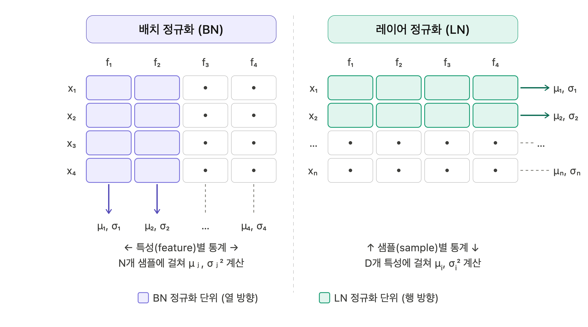

# 주제: 배치 정규화와 레이어 정규화 분석 및 비교

## 요약
- **정규화(Normalization)**: 학습 데이터의 스케일을 조정(0~1)해 과적합을 줄이고
  학습 안정성을 높이는 기법
- **내부 공변량 변화(Internal Covariate Shift)**: 학습 중 층을 지날수록 입력 데이터의 분포가 달라지는 현상 → 배치 정규화로 해결
- **배치 정규화(BN:Batch Normalization)** 는 하나의 배치 안에서 같은 feature끼리(열 방향) 평균·분산을 계산한다.    
  → 이미지 데이터(CNN)에 적합, 배치 크기에 의존적
- **레이어 정규화(LN:Layer Normalization)** 는 하나의 샘플 안에서 모든 feature에 걸쳐(행 방향) 평균·분산을 계산한다.     
  → 시퀀스 데이터(Transformer, RNN)에 적합, 배치 크기에 독립적   
- 두 기법은 **입력 데이터의 형태와 모델 구조**에 따라 기법을 선택한다.

## 본문

### 정규화(Normalization)
- AI 모델에서 **과적합**을 줄이기 위한 **스케일링(0 ~ 1) 기법**
- 사용 이유: 과적합을 줄이고 학습을 안정화해서 성능 향상에 기여
- 스케일링
  - min-max 정규화 : 모든 데이터에서 최소값과 최대값을 이용해서 스케일링  

$$
X_{norm} = \\frac{X-X_{min}}{X_{max}-X_{min}}
$$

- 기호 설명
  - $X$ : 입력 전체 행렬
  - $X_{min}$: 입력 행렬의 최솟값
  - $X_{max}$: 입력 행렬의 최대값

### 배치(Batch)
- 한번에 모델이 학습하는 데이터 **샘플들의 묶음**
- 배치 크기(batch size): 1 batch에 속한 샘플 데이터 수
- 미니 배치(mini-batch) : 배치 1개를 지칭 -> 1번째 미니배치        
예) 총 데이터 1000개 batch size = 100 이면 batch = 10    
  -> 모델은 한번 학습할때 100개의 데이터 샘플을 한번에 처리한 후에 가중치,편향 등의 파라미터들을 업데이트

### 내부 공변량 변화(Internal Covariant Shift)
  - 학습과정에서 계층(Layer) 별로 입력 데이터 분포가 달라지는 현상
    
    | 층(Layer)  |    입력층    |                     히든층                                 |     출력층    | 
    |-----------|-------------|----------------------------------------------------------|--------------|
    |           | 입력 데이터 분포| 1st Layer Feature 분포 ->  ...  ->  Nth Layer Feature 분포 | 출력 데이터 분포 |

  - 문제점
    -1차 문제점: 히든층을 지날때 마다 **Feature 분포 변화율**은 **누적 증가**
      - 1차 해결책: 적절한 가중치(weight)의 초기화, 작은 학습률(learning rate) 세팅
        - 해결책의 문제점: 가중치 초기화는 어려운 방법이며, 학습률이 작으면 지역 극솟값(local minimum)에 빠짐
    - 2차 문제점: 배치 단위별로 데이터 분포에 차이가 발생
      - 2차 해결책: 배치 정규화

### 배치 정규화(Batch Normalization)
- 학습 과정에서 각층의 입력데이터 불균형을 해결을 위해 배치 기반으로 정규화(Normalization)기법
- 정규화 단위: 하나의 **배치에서의 feature** 값들의 평균과 분산을 계산해서 정규화
- 정규화 시점: 활성화 함수 전
- Forward

$$
BN(X) = \gamma\left(\\frac{X-\mu_{batch}}{\sigma_{batch}}\right) + \beta 
$$
$$
\mu_{batch} = \\frac{1}{B} \\sum_{i=1} x_i
$$
$$
\sigma_{batch} = \\sqrt{\\frac{1}{B} \\sum_{i=1} (x_i-\mu_{batch})^2}
$$

- 기호 설명
  - $X$: 입력 데이터 전체 행렬 -> (B, C, H, W)텐서
  - $x_i$: 특정 채널의 픽셀값 하나 (예: 3번째 이미지 빨간 채널 (2,5) 위치 픽셀)
  - $B$: 배치 크기
  - $\mu_{batch}$: 한 배치에서 B개 데이터의 feature 평균
  - $\sigma_{batch}$: 한 배치에서 B개 데이터의 분산
  - $\gamma$, $\beta$: 강제로 평균 0, 분산 1이 된 분포를 모델이 원하는 분포로 복원할 수 있게 해주는 학습 파라미터

- Backward

$$
\frac{\partial \mathcal{L}}{\partial \gamma} = \sum_{i=1}^{B} \frac{\partial \mathcal{L}}{\partial y_i} \cdot \hat{x}_i
$$
$$
\frac{\partial \mathcal{L}}{\partial \beta} = \sum_{i=1}^{B} \frac{\partial \mathcal{L}}{\partial y_i}
$$
$$
\frac{\partial \mathcal{L}}{\partial x_i} = \frac{\gamma}{B \cdot \sigma_{batch}} \left[ B \frac{\partial \mathcal{L}}{\partial \hat{x}_i} - \sum_{k=1}^{B} \frac{\partial \mathcal{L}}{\partial \hat{x}_k} - \hat{x}_i \sum_{k=1}^{B} \frac{\partial \mathcal{L}}{\partial \hat{x}_k} \hat{x}_k \right]
$$

- 기호 설명
  - $\frac{\partial \mathcal{L}}{\partial \gamma}$, $\frac{\partial \mathcal{L}}{\partial \beta}$: 학습 파라미터 γ, β의 그래디언트 → 옵티마이저가 갱신
  - $\frac{\partial \mathcal{L}}{\partial x_i}$: 입력값의 그래디언트 → 이전 층으로 전달
  - 합산 방향: **배치(B)** → 서로 다른 샘플의 그래디언트가 결합됨

- 성능확인된 모델
  - MNIST 데이터: 0~9를 표현한 숫자 손글씨 분류 모델에서 성능과 안정성 개선 입증 
- 단점
  - 배치 크기(batch size)에 의존적
    - 하이퍼 파라미터여서 직접 세팅필요
    - 값이 너무 작으면 모델에서 작동되지않음(batch size =  1이면 분산은 항상 0 )
  - RNN 모델에 적용 어려움
    - 한 미니 배치의 입력데이터(이미지 데이터)는 크기가 모두 같다. 
    - 한 미니 배치의 입력데이터(시퀀스 데이터여)는 길이가 다르다.

### 레이어 정규화(Layer Normalization)
- 학습 과정에서 입력데이터(시퀀스데이터)의 길이에 따라 내부 상태가 크게 변할수있음.
- 정규화 단위: 하나의 **샘플 데이터 단위에서의 feature** 값들의 평균과 분산을 계산해서 정규화
- 배치사이즈에 영향 안받음
- Forward

$$
LN(X) = \gamma\left(\frac{X-\mu_{layer}}{\sigma_{layer}}\right) + \beta
$$
$$
\mu_{layer} = \frac{1}{D} \sum_{i=1}^{D} x_i
$$
$$
\sigma_{layer} = \sqrt{\frac{1}{D} \sum_{i=1}^{D} (x_i-\mu_{layer})^2}
$$
- 기호 설명
  - $X$: 입력 데이터 전체 행렬 -> 미니배치 전체 토큰 임베딩 묶음 — {(B,T,D)(B, T, D)(B,T,D)}
    - B: 문장수(배치), T: 단어(토큰)수, D: 토큰 하나의 숫자 벡터 길이(차원크기)
  - $x_i$: 특정 토큰 임베딩 벡터의 차원값 하나 (예: "고양이" 토큰 임베딩의 42번째 값)
  - $D$: 레이어(특성) 차원 크기
  - $\mu_{layer}$: 한 샘플에서 D개의 feature값 평균
  - $\sigma_{layer}$: 한 샘플의 D개의 feature 분산

- Backward

$$
\frac{\partial \mathcal{L}}{\partial \gamma} = \sum_{i=1}^{B} \frac{\partial \mathcal{L}}{\partial y_i} \cdot \hat{x}_i
$$
$$
\frac{\partial \mathcal{L}}{\partial \beta} = \sum_{i=1}^{B} \frac{\partial \mathcal{L}}{\partial y_i}
$$
$$
\frac{\partial \mathcal{L}}{\partial x_i} = \frac{\gamma}{D \cdot \sigma_{layer}} \left[ D \frac{\partial \mathcal{L}}{\partial \hat{x}_i} - \sum_{k=1}^{D} \frac{\partial \mathcal{L}}{\partial \hat{x}_k} - \hat{x}_i \sum_{k=1}^{D} \frac{\partial \mathcal{L}}{\partial \hat{x}_k} \hat{x}_k \right]
$$

- 기호 설명
  - $\frac{\partial \mathcal{L}}{\partial \gamma}$, $\frac{\partial \mathcal{L}}{\partial \beta}$: 학습 파라미터 γ, β의 그래디언트
  - $\frac{\partial \mathcal{L}}{\partial x_i}$: 입력값의 그래디언트 → 이전 층으로 전달
  - 합산 방향: **특성(D)** → 같은 샘플 내에서만 그래디언트가 결합됨

- 단점
  - CNN에서 BN보다 성능이 낮은 경향
  - 가중치 초기화, 학습률 세팅과 같은 하이퍼 파라미터 세팅에 민감

## 결론
배치 정규화와 레이어 정규화는 **정규화 축**이 다를 뿐, 수식 구조는 동일하다.

| | 배치 정규화 (BN) | 레이어 정규화 (LN) |
|---|---|---|
| 정규화 축 | 배치 방향 (같은 feature, B개 샘플) | 특성 방향 (같은 샘플, D개 feature) |
| 배치 크기 의존 | 의존 | 독립 |
| 주요 적용 모델 | ResNet, EfficientNet 등 CNN 계열 | GPT, BERT, LLaMA 등 Transformer 계열 |

따라서 **입력 데이터의 형태와 모델 구조**에 따라 기법을 선택해야 한다.
고정 크기 이미지와 충분한 배치가 보장되면 BN, 가변 길이 시퀀스이거나 배치가 작으면 LN이 유리하다.

