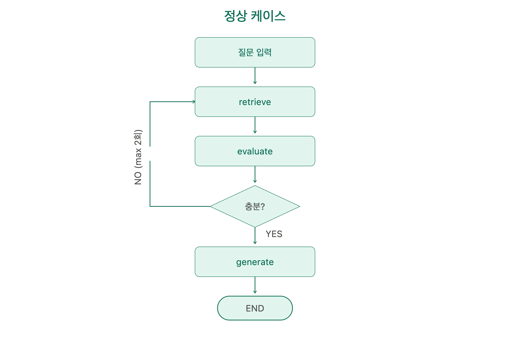
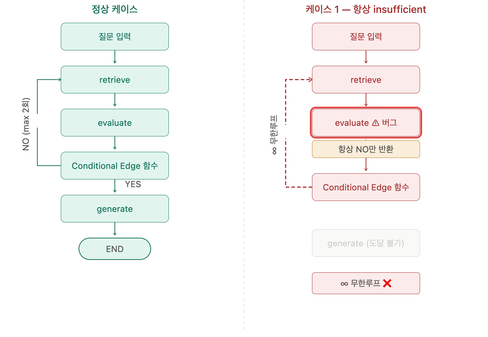
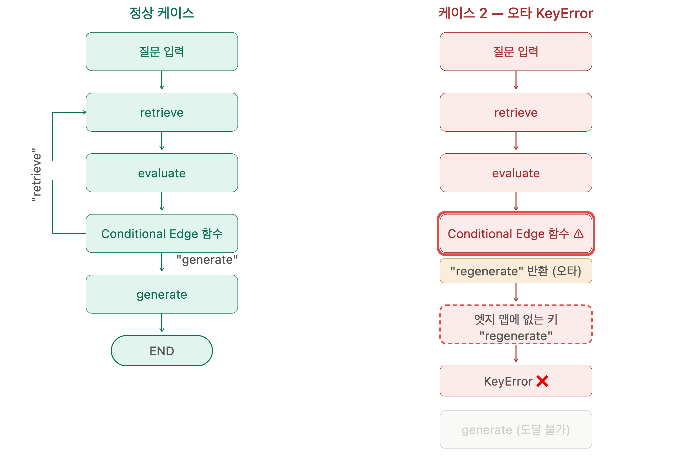
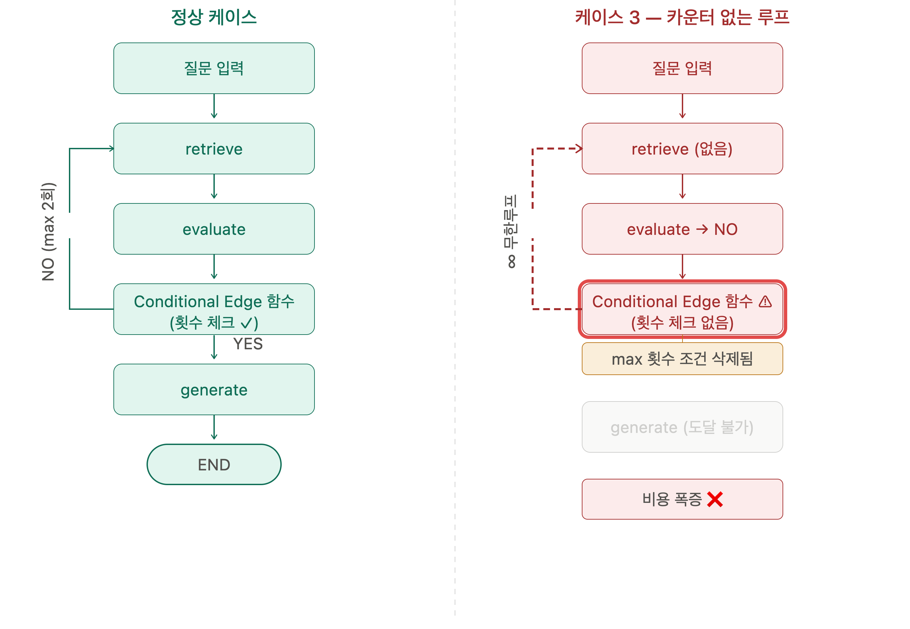
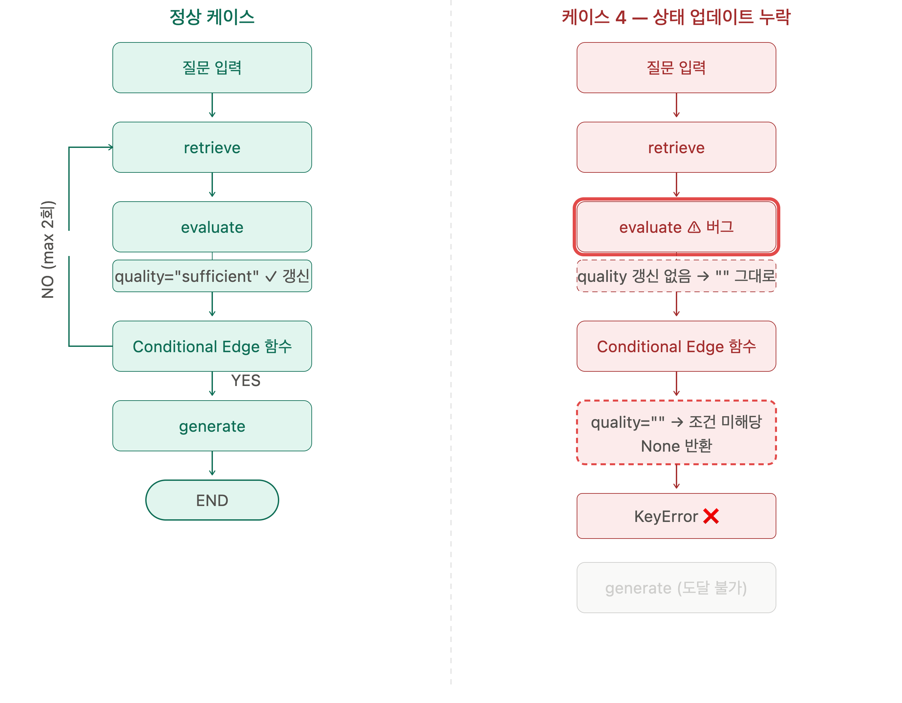
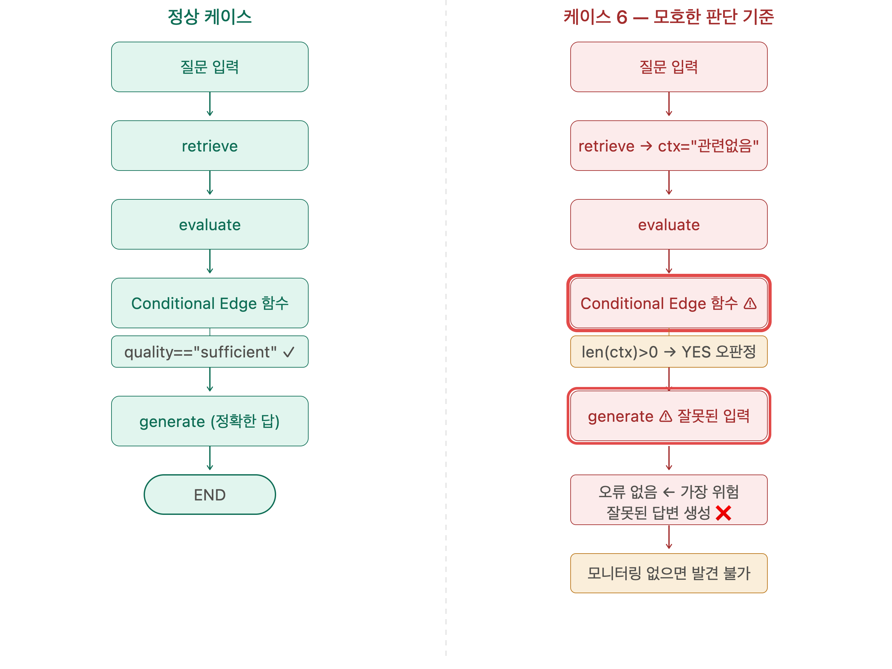

# 주제
- LangGraph의 Conditional Edges가 그래프 실행 흐름을 동적으로 제어하는 방식을 설명하시오. 
- 조건 판단 기준이 모호하거나 잘못 설계되었을 때 실행 흐름에 어떤 문제가 발생할 수 있는지 서술하시오.

## 본문
### Conditional Edges
- StateGraph에서  add_conditional_edges로 분기처리하는 엣지
- conition_function: 현재 상태를 평가해서 다음 노드를 결정 하는 함수
  - 입력: state
  - 출력: 문자열, 열거형 데이터
    
#### 코드 형태
~~~
from langgraph.graph import StateGraph, END 

workflow = StateGraph(State) 

def condition_function(state):
  if {state 평가1}:
    return "condition1"
  elif {state 평가2}:
    return "condition2"
        ...
  else
    return "conditionN"

workflow.add_conditional_edges(
	"source_node", condition_function, 
		{ 
			"condition1": "target_node1", 
			"condition2": "target_node2",
                  ...,
      "conditionN": "target_nodeN",
			"default": END 
		} 
	)
~~~ 

### 동적으로 제어하는 방식

- 성공적인 플로우차트
	- 구성
   		- 질문 입력 노드
   		- retreve 노드
   		- evaluate 노드
   		- Conditional 엣지(노드X)
   		- route 노드(충분?)
   		- generate 노드		 	

### 잘못된 설계

- 케이스 1
	- evaluate 버그 발생으로 Conditional Edge 함수에서 항상 "No" 만 대답하는 state를 전달   
	- Loop Max를 설정한 경우: max까지 반복하고 잘못된 평가로 generate 도달(잘못된 답변 생성 가능성 높음)   
	- Loop Max를 설정안한 경우: 무한루프 -> generate 도달 못함(비용증가)    
	
   
- 케이스 2  
	- route 노드 에서 없는 목적지("regenerate")를 뱉어서 에러 발생하고 종료   
	
  
- 케이스 3
	- Loop Max를 설정안한 경우: 무한루프 -> generate 도달 못함(비용증가) 
	
   
- 케이스 4  
	- evaluate 노드: 버그로 state의 값 갱신 없는 상태로 Conditional Edge 함수로 state를 전달  
	- 조건 판단에서 새로운 state 값이 필요한 경우  
		- 값이 없어서 keyerror 발생하면서 에러 발생하고 종료  
	- 조건 판단에서 기존 state 값만 필요한 경우  
		- 잘못된 조건을 성립하면서 generate 도달(잘못된 답변 생성 가능성 높음)   
		

	- Conditional Edge 함수의 애매모호한 분기 설정
		- 예) retrive 문서의 문자열 길이 
	- 관련 문서가 없지만 그중에서도 비슷한 문서를 가져온 경우
		-> 감자요리 레시피를 요청했는데 없어서 감자를 재배하는 문서를 찾음
		-> 분기점에서 문서를 못찾았으므로 답변없음으로 답하기

결론
버글를 대비해서
모든 가능상황을 고려했는지 확인한다.함수로직이 간단하고 명확을 유지한다. 복잡한 조건은 필요의 경우 여러 작은 함수로 분할한다.
테스트를 통해 예상 작동을 확인한다.

