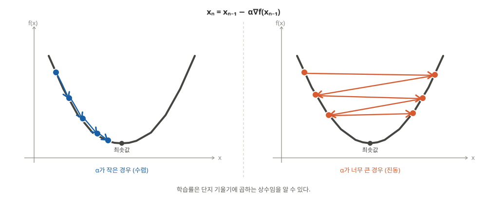
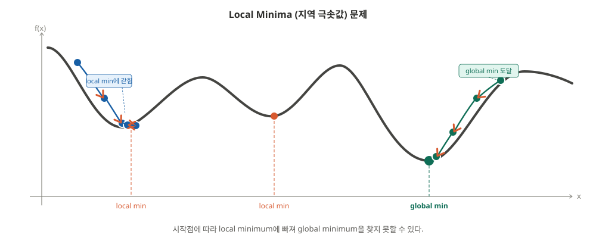
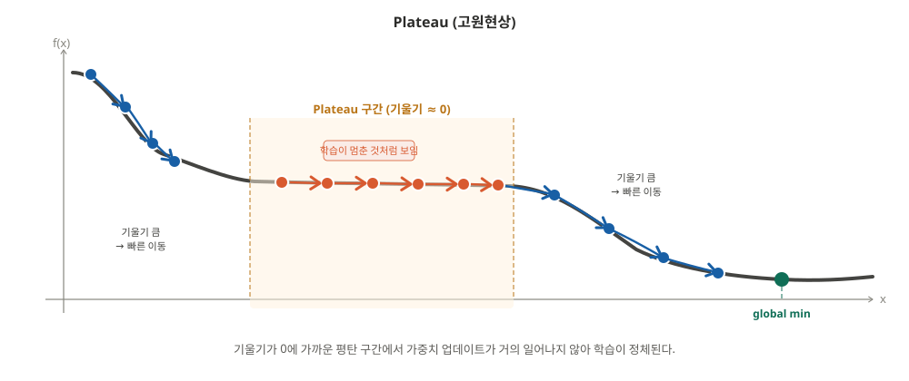
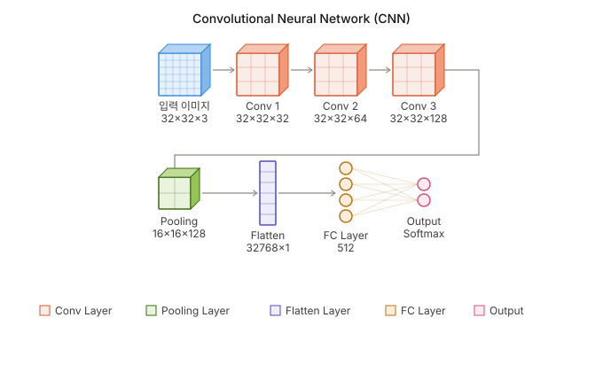
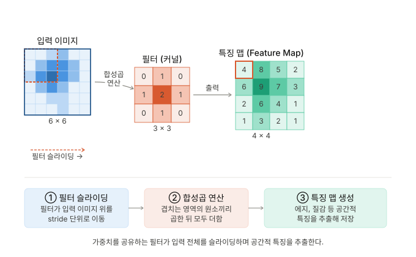
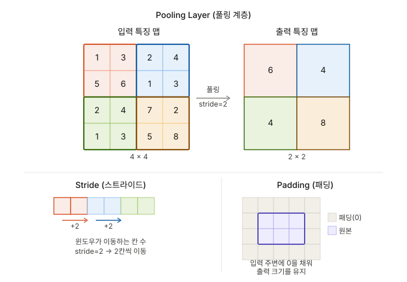
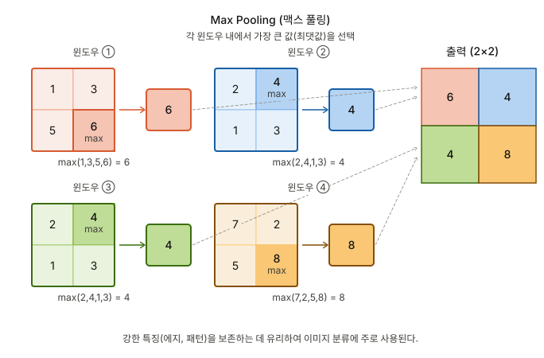
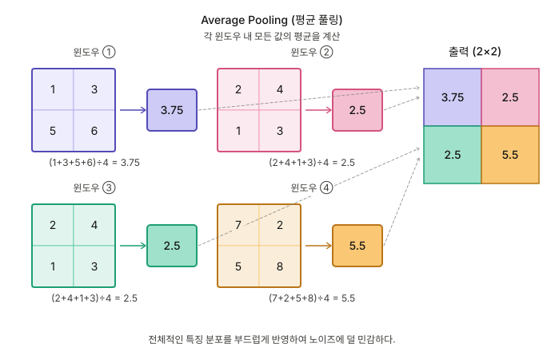
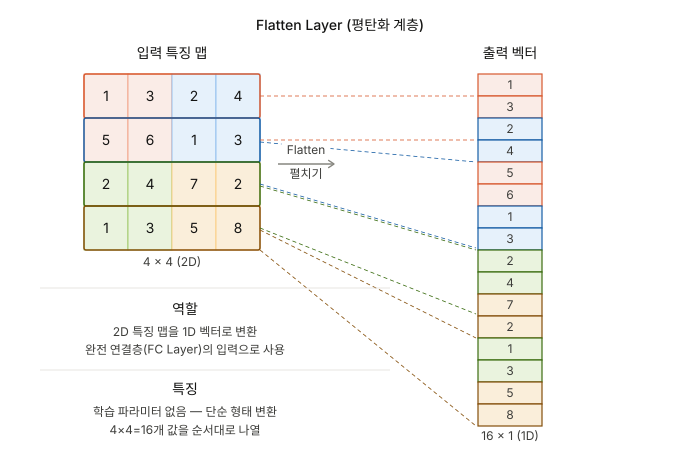

# CNN

## Gradient Descent(경사하강법)
- **손실함수를 최소화**하기위 위해 **가중치**를 반복적으로 조정하는 **최적화 알고리즘**
  - 기울기를 미분하면서 가중치 업데이트-> 최적의 손실 값을 찾는 과정
  - 하이퍼 파라미터: 학습률(learning_rate or step_size)
  - 한계점
    - 기울기 소실
		  - 네트워크의 깊은 층으로 갈수록 기울기가 점점 작아져서 가중치 업데이트가 거의 이루어지지 않는 현상
      		(활성화 함수 Sigmoid, Tanh에서 주로 발생, Relu 함수는 일부 완화하지만 음수영역에서 뉴런이 죽는 문제발생)
      
    - 과진동
      - 학습률을 크게 설정할 경우 최솟값계산에 오래 걸리거나, 못구한다 
      - 학습률을 작게 설정할 경우 최솟값계산에 오래 걸리거나, 못구한다  
        
		
    - 지역 극솟값(Local Minima)
      - 시작점은 램덤으로 시작하기때문에, 낮은 학습률때문에 지역 극솟값에 갖힌다.
      - 하지만 항상 지역 극솟값이 나쁜것은 아니다 / 항상 전역 극솟값이 최적인것은 아니다      
        
		
    - 고원 현상(Plateau)
      - 손실함수의 평평한 구간에서 기울기는 0에 수렵한다. 결국 가중치 업데이트가 미미하거나, 안되는 문제가 발생한다.     
        
		
  - 예제 코드
    ~~~
    ##
    import numpy as np

    ## 1.임의의 랜덤 데이터 생성 ##
    
    np.random.seed(42)
    # X는 0과 2사이의 랜덤값 100 개
    X = 2 * np.random.rand(100, 1)
    # y는 3X+4 에 noise를 추가한 값 100개
    y = (4 + 3 * X) + np.random.randn(100, 1)
    # 파라미터 초기화(가중치 램덤설정)
    theta = np.random.randn(2, 1)

    ## 2.순전파 계산 ##
    
    # X 데이터에 bias(여기는 np.ones로 1)를 추가
    X_b = np.c_[np.ones((100, 1)), X]

    ## 3.손실계산 ##
    
    def compute_cost(X_b, y, theta):
    m = len(y)
    # (예측값 - 실제값)^2의 전체합의 평균
    cost = (1 / (2 * m)) * np.sum(np.square(X_b.dot(theta) - y))
    return cost
    
    ## 4.경사 계산 ##
    
    # 기울기 계산
    def compute_gradient(X_b, y, theta):
      m = len(y)
      # 기울기 도출
      gradients = 2 / m * X_b.T.dot(X_b.dot(theta) - y)
      return gradients
    
    ## 5.가중치 업데이트 ##
    
    # 경사하강법
    def gradient_descent(X_b, y, theta, learning_rate, n_iterations):
      for iteration in range(n_iterations):
        # 기울기 도출
        gradients = compute_gradient(X_b, y, theta)
        # 가중치 업데이트(기울기 반대방향)
        # theta + (learning_rate * -gradients)
        theta = theta - learning_rate * gradients
      return theta

    ## 6.반복 ##
    # 학습률과 경사하강법 반복 횟수 설정
    learning_rate = 0.1
    n_iterations = 1000

    # 경사 하강법 실행 -> 최적의 가중치
    theta_best = gradient_descent(X_b, y, theta, learning_rate, n_iterations)

    print("최적의 파라미터:", theta_best)
    
    ~~~

	~~~

    """
    번외
        a = {[1,2,3],      b = {[7,8,9],
              [4,5,6]}           [10,11,12]}
  
      * np.r_[a,b]는 a와b 배열을 세로방향으로 결합
            [[ 1  2  3]
             [ 4  5  6]
             [ 7  8  9]
             [10 11 12]]
  
      * np.c_[a,b]는 a와b 배열을 가로방향으로 결합(두 배열의 행크기가 같아야한다)
            [[ 1  2  3  7  8  9]
             [ 4  5  6 10 11 12]]
    """
	~~~

----

## Convolutional Neural Network (CNN) 
- 여러 개의 Convolutional Layer, Pooling Layer, Fully Connected Layer 들로 구성된 신경망
- 사용이유: 2D 데이터의 특징을 자동 추출 및 학습하여 높은 성능을 발휘하기 위해서
- 특징(Feature): 데이터의 개별 속성 또는 변수  
  - 예) 흑백이미지 (28,28)은 28*28*1 = 784개를 가짐, 컬러이미지 (28,28)은 28*28*3 = 2352개를 가짐
- CNN vs ANN
  	| 항목 | ANN (인공 신경망) | CNN (합성곱 신경망) |
	|------|------------------|-------------------|
	| **풀네임** | Artificial Neural Network | Convolutional Neural Network |
	| **주요 용도** | 표 형태 데이터, 분류, 회귀 | 이미지, 영상, 음성 처리 |
	| **기본 구성** | 입력층 → 은닉층 → 출력층 | 입력층 → Conv층 → Pooling층 → FC층 → 출력층 |
	| **주요 연산** | 행렬 곱 (완전 연결) | 합성곱 (Convolution) + Pooling |
	| **파라미터 연결** | 모든 뉴런이 다음 층과 완전 연결 | 필터(커널)가 지역적으로 연결 |
	| **공간 정보 보존** | ❌ 1D로 펼쳐서 입력 | ✅ 2D/3D 구조 그대로 처리 |
	| **가중치 공유** | ❌ 각 연결마다 별도 가중치 | ✅ 필터가 입력 전체에 공유됨 |
	| **적합한 데이터 종류** | 정형 데이터 (표, 수치) | 이미지, 영상, 음성 |
	| **대표 사례** | 주가 예측, 의료 진단, 추천 시스템 | 이미지 분류, 객체 탐지, 얼굴 인식 |
	| **대표 모델** | MLP (다층 퍼셉트론) | LeNet, VGG, ResNet, EfficientNet |

### Convolutional Layer (합성곱 계층) 
- 컨볼루션 마스크(Convolution Mask)를 통해 일반적인 **특징(Feature)을 추출하는 레이어**
- 과정: input(입력이미지 또는 이전단계 추출된 특징) -> mask 통과 -> output(특징맵(Feature Map):추출된 특징)
- 컨볼루션 마스크(Convolution Mask) or 필터(Filter)   
	- 가중치정보 필터(weight 담당)   
 	- 연산 순서: 마스크와 합성곱(Convolution) 계산-> Bias 항 추가 -> Relu 활성화 함수 실행   
  	- 수가 많을 수록 더 많은 정보 추출 가능 -> 하지만 연산량 증가   

### Pooling Layer (풀링 계층)
- 특징맵(Feature Map)의 공간 크기를 줄여 계산량을 감소시키고, 중요한 특징을 추출하며, 과적합을 방지하는 역할을 하는 레이어
- 사용이유: 인위적인 손실(줄임) (연산량 감소, 불변성(이동,스케일,회전) 확보,과적합 방지, 중요 특징(엣지,경계) 추출)  
	-> 특징맵의 모든 데이터를 전부 처리하는것은 필수가 아니다.  
	-> 중요한 부분, **특징적인 부분만 처리**하자  
	-> 즉, **불필요한부분의 삭제**라고 보면 된다  
  
- 종류
	- 맥스풀링(Max Pooling)
 		- 풀링영역 내에서 **가장 큰 값을 대표**로 하는 방식
   		- 특징의 존재 유무 명확(이미지 분류, 물체인식에 주로 사용)
     	- 단점: 극단적인 값에 집중
        
	- 평균풀링(Aveerage Pooling)
 		- 풀링영역 내에서 **평균을 구해서 대표**로 하는 방식
  		- 사용이유: 노이즈 및 이상치 완화(상쇄), 모델의 급격한 변동 방지
    	- 단점: 특징이 옅어짐
      	   	

### Flatten Layer (평탄화 계층)
- 다차원 배열 데이터를 1차원 배열로 변환하는 레이어(풀링 계층의 특징맵들을 1자로 펼침)
- 과정: input(풀링 후 특징맵(Batch,Height,Width,Channels)) -> Flattening(평탄화) -> output((Batch,Height*Width*Channels)):추출된 특징 묶음)
	- Batch: 딥러닝 모델에서 한번의 훈련에서 처리하는 데이터 묶음(이미지 묶음),
 	- Sample: Batch 안에 들어있는 개별 데이터 하나(이미지는 1개 의미)
  	- Feature: 특징벡터(샘플을 Flatten한 결과)
  	- 예) (32, 14, 14, 8) -> (32, 1568)
- 사용이유: Fully Connected Layer에 입력하기 위해서
  

