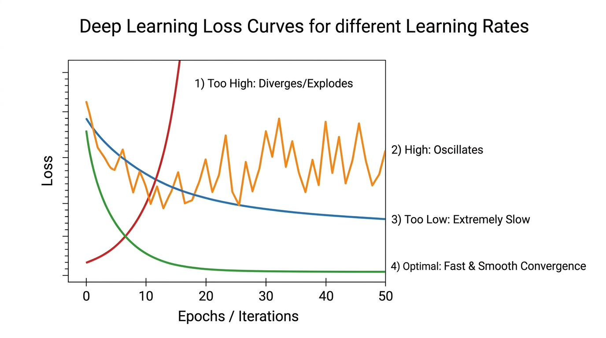
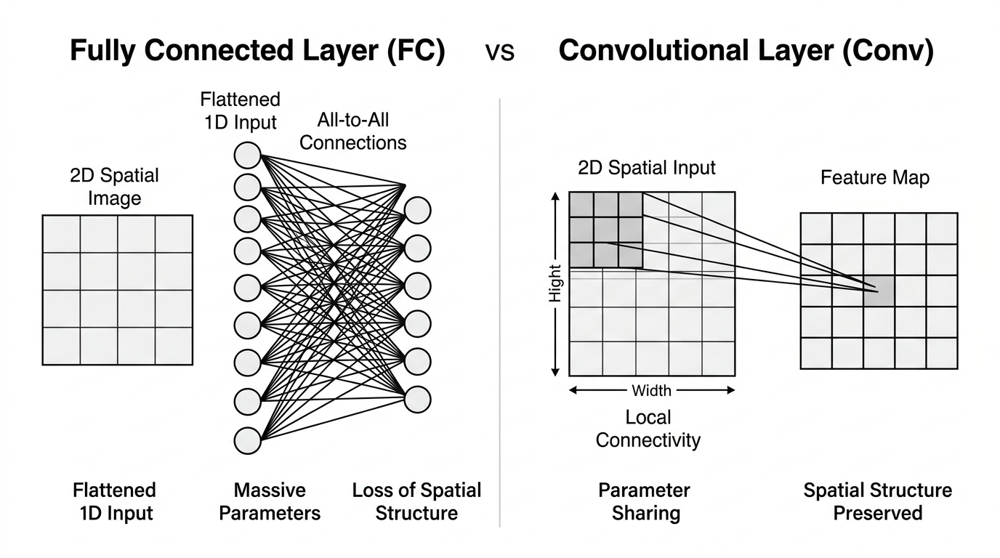
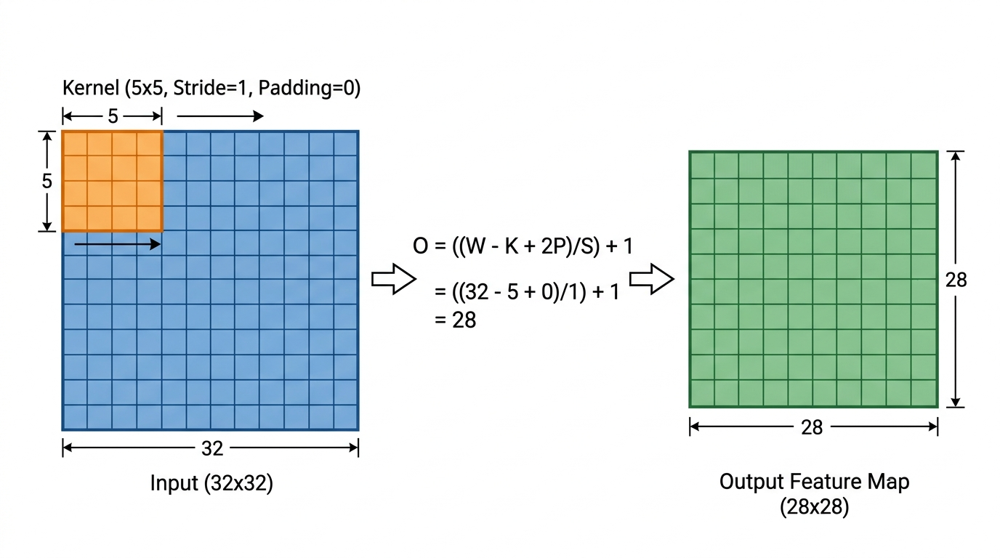
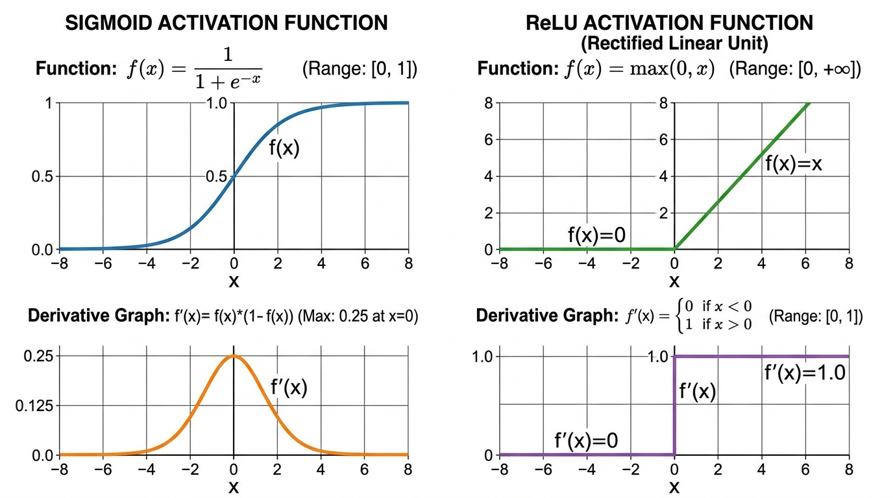
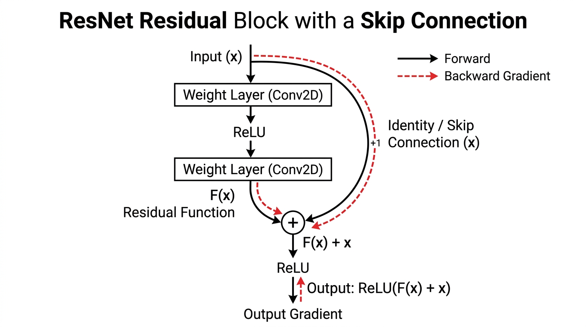
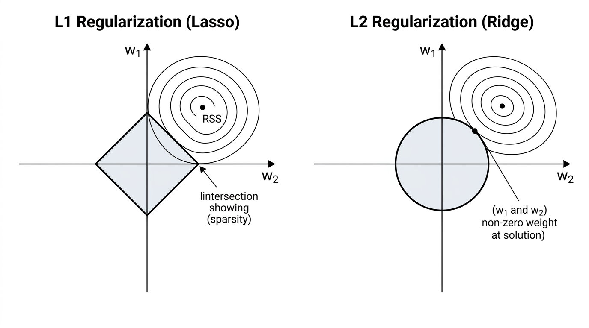

# 4주차 딥러닝 모의면접 핵심 정리 & 면접관 체크리스트

이 문서는 **면접자**가 면접관 앞에서 어색한 비유 없이 **전문적이고 논리적인 엔지니어링 언어**로 답변을 전개할 수 있도록 핵심 개념과 기술적 인과관계를 체계적으로 정리한 지침서입니다. 계산 문제(3번)는 **공인된 표준 수식과 엄밀한 계산 과정**을 명시하였으며, 모든 문항은 최하단의 학술 출처에 기반합니다.

---

### 1. 학습률이 너무 크거나 작을 때 손실 곡선이 각각 어떤 모양을 보이는지, 그리고 이를 진단한 뒤 어떻게 대응할지 설명해 주세요.

> **🎙️ [실전 모의면접] 핵심 구술 답변:**
> * **손실 곡선 모양:** 학습률이 너무 크면 오버슈팅으로 인해 손실이 진동하거나 무한대(`NaN`)로 발산하고, 너무 작으면 손실 감소가 극도로 느려 평평한 직선 형태로 기어가며 조기 정체(과소적합)됩니다.
> * **진단 및 대응:** 본 학습 전 **LRFinder**로 손실 감소율이 최대인 최적 학습률을 탐색하고, 학습 시 **Warmup**(초기 안정화)과 **Cosine Annealing**(후반 미세 수렴) 스케줄러를 적용해 대응합니다.

**🎯 면접관 필수 체크 키워드:**
*   [ ] **과대 학습률 (High LR):** 오버슈팅(Overshooting), 손실 진동(Oscillation), 손실 폭발 및 수치적 발산(`NaN`/`Inf`)
*   [ ] **과소 학습률 (Low LR):** 거의 수평에 가까운 선형적 감소(Linear Decay), 극도로 느린 수렴 속도, 조기 정체 및 과소적합
*   [ ] **최적 학습률 (Good LR):** 초기 지수적 급감(Exponential Decay) 후 바닥 근처에서 완만하게 수렴하는 안정적인 감소 곡선
*   [ ] **진단 및 대응 전략:** LRFinder (Learning Rate Range Test), Warmup 스케줄링, Cosine Annealing, ReduceLROnPlateau

**💡 핵심 지식 포인트 (전문적인 구술 설명):**



*   **손실 곡선(Loss Curve)의 진단 양상:**
    *   *학습률이 지나치게 클 때:* 오차 표면(Loss Surface)의 국소 곡률 대비 갱신 스텝이 너무 커서 최적점(Minimum)을 건너뛰는 **오버슈팅(Overshooting)**이 발생합니다. 그 결과 손실이 바닥으로 내려가지 못하고 양쪽 경사면 사이에서 극심하게 진동하거나, 기울기가 지수적으로 누적되어 수치가 컴퓨터 표현 한계를 초과하면서 `NaN` 또는 무한대(`Inf`)로 **발산(Divergence)**합니다.
    *   *학습률이 지나치게 작을 때:* 가중치 업데이트 크기가 미미하여 에포크가 진행되어도 손실 감소율이 거의 0에 가깝습니다. 곡선이 **수평에 가까운 완만한 직선 형태**를 띠며, 허용된 연산 자원 내에 최적점에 도달하지 못해 **과소적합(Underfitting)**에 머물게 됩니다.
    *   *적정 학습률:* 학습 초반에는 가파른 기울기를 타고 손실이 급격히 감소하다가, 최적해에 근접할수록 기울기 크기가 줄어들며 완만하게 평탄화되는 형태를 보입니다.
*   **진단 및 대응 전략:**
    *   **진단 (LRFinder):** 본 학습 전, 배치 단위로 학습률을 $10^{-7}$부터 $10^1$까지 지수적으로 증가시키며 손실 변화를 기록합니다. 손실 곡선에서 **감소 기울기가 가장 가파른 지점(Maximum Steepest Slope)**을 기본 학습률($\eta$)로 채택합니다.
    *   **대응 (스케줄링 기법):**
        1.  **Gradual Warmup:** 학습 극초기에는 무작위 초기화된 가중치로 인해 기울기의 방향 분산이 큽니다. 작은 학습률로 시작해 일정 스텝 동안 선형적으로 목표 학습률까지 끌어올려 초기 수렴 안정성을 확보합니다.
        2.  **Cosine Annealing:** 학습 후반부에는 반주기 코사인 함수 형태로 학습률을 점진적으로 0에 가깝게 감쇠시켜, 최적점 근방에서의 불필요한 진동을 억제하고 미세 수렴을 달성합니다.

**🔍 심층 꼬리 질문 & 대응 가이드 (면접관용):**
*   **Q1. "배치 크기를 32에서 512로 16배 키웠을 때, 학습률은 어떻게 조정해야 할까요?"**
    *   👉 **답변 포인트 (Linear Scaling Rule, Goyal et al., 2017):** 배치 크기가 $k$배 커지면 미니배치 기울기 추정치의 분산(노이즈)이 감소하므로, 학습률 역시 비례하여 $k$배 증가시키는 **선형 스케일링 규칙 ($\eta_{new} = k \times \eta_{base}$)**을 적용합니다. 단, 커진 학습률로 인한 초기 발산을 방지하기 위해 첫 5 에포크 가량은 **Gradual Warmup**을 반드시 병행해야 합니다.

**📚 필수 핵심 용어 해설:**
*   **오버슈팅 (Overshooting):** 최적화 과정에서 경사 반대 방향으로 이동할 때, 스텝 크기(학습률)가 너무 커서 최저점을 지나쳐 반대편의 더 높은 손실 영역으로 뛰어넘는 현상.
*   **LR Range Test (LRFinder):** 학습률을 동적으로 증가시키며 최적의 학습률 구간을 1에포크 내외의 짧은 탐색만으로 결정하는 실험적 진단 기법.

---

### 2. 합성곱 계층이 완전 연결 계층 대비 갖는 장점을 파라미터 공유(parameter sharing)와 지역 연결성(local connectivity) 관점에서 설명해 주세요.

> **🎙️ [실전 모의면접] 핵심 구술 답변:**
> * **지역 연결성:** FC는 모든 노드를 무차별 연결하여 공간 구조를 파괴하고 파라미터가 폭증하지만, Conv는 인접한 $K \times K$ 픽셀만 국소적으로 연결하여 이미지의 공간적 기하 패턴을 보존하고 연산량을 줄입니다.
> * **파라미터 공유:** FC는 연결선마다 고유 가중치를 갖지만, Conv는 단일 필터를 이미지 전체에 슬라이딩하며 재사용하므로 파라미터 수를 수만 분의 일로 압축하고 사물의 위치 이동에 무관하게 동일하게 검출하는 **이동 등변성**을 보장합니다.

**🎯 면접관 필수 체크 키워드:**
*   [ ] **완전 연결(FC) 계층의 구조적 한계:** 2차원 공간 기하 구조의 1차원 평탄화(Flatten)로 인한 공간 정보 손실, 과도한 파라미터 폭증 및 과적합
*   [ ] **지역 연결성 (Local Connectivity / Local Receptive Field):** 자연 이미지의 공간적 국소성(Spatial Locality) 반영, 인접 픽셀 간의 상관관계만 국소적으로 수용
*   [ ] **파라미터 공유 (Parameter Sharing / Weight Tying):** 단일 필터의 가중치를 전체 공간 영역에 합성곱하여 파라미터 수 급감 및 이동 등변성(Translation Equivariance) 확보

**💡 핵심 지식 포인트 (전문적인 구술 설명):**

*   **0. 두 계층의 기본 개념 및 용어 정의 (출발점):**
    *   **완전 연결 계층 (Fully Connected Layer, FC / Dense Layer):**
        *   *개념:* 이전 층의 모든 뉴런이 다음 층의 모든 뉴런과 빠짐없이 1:1로 전부 연결(All-to-All)되는 전통적인 다층 퍼셉트론(MLP)의 기본 계층입니다.
        *   *입력 형태:* 오직 **1차원 벡터($1D$)**만 입력받을 수 있습니다. 따라서 2D/3D 이미지를 넣으려면 가로세로 격자를 1줄로 길게 펼치는 **평탄화(Flatten)**를 반드시 거쳐야 합니다.
        *   *연산:* $y = Wx + b$ (거대한 가중치 행렬 곱셈).
    *   **합성곱 계층 (Convolutional Layer, Conv):**
        *   *개념:* 이미지의 2차원 공간 형상($H \times W \times C$)을 원형 그대로 유지한 채, 작은 크기의 **필터(커널, 예: $3 \times 3$)를 이미지 위에서 슬라이딩(합성곱)**시키며 특징 맵(Feature Map)을 뽑아내는 계층입니다.
        *   *입력 형태:* 높이, 너비, 채널을 보존하는 **다차원 텐서($3D$)**를 직접 다룹니다.
        *   *연산:* $y = x * W + b$ (필터와 국소 영역 간의 원소별 곱셈 후 합산).



*   **1. 지역 연결성(Local Connectivity) 관점에서의 FC vs Conv 비교:**
    *   **완전 연결 계층 (FC - 전역 연결, Global Connectivity):**
        *   모든 입력 픽셀이 모든 출력 뉴런과 무차별적으로 1:1 전부 연결(All-to-All / Dense)됩니다.
        *   *문제점:* 바로 옆에 붙어 있는 픽셀(거리 1)이나 저 멀리 반대편 구석에 있는 픽셀(거리 1,000)이나 **똑같은 가중치 연결선으로 대등하게 취급**합니다. 즉, 이미지의 본질인 "가까운 픽셀끼리 뭉쳐서 물체를 이룬다"는 공간적 국소성(Spatial Locality)을 전혀 반영하지 못해 불필요한 연산 낭비와 잡음 학습을 유발합니다.
    *   **합성곱 계층 (Conv - 지역 연결, Local Connectivity):**
        *   이미지 전체를 한 번에 연결하지 않고, 커널 크기($3 \times 3$, $5 \times 5$ 등)에 해당하는 **서로 인접한 국소 영역의 픽셀들하고만 희소하게 연결(Sparse Interaction)**을 형성합니다.
        *   *장점:* 물체의 윤곽선, 모서리, 질감 등 시각 정보의 핵심인 '국소적 기하 패턴'에만 집중하므로 불필요한 원거리 연결을 배제하여 연산 효율과 공간 특징 보존을 극대화합니다.

*   **2. 파라미터 공유(Parameter Sharing) 관점에서의 FC vs Conv 비교:**
    *   **완전 연결 계층 (FC - 파라미터 비공유, No Sharing):**
        *   입력 노드 $i$와 출력 노드 $j$ 사이의 연결선마다 **오직 그 위치에서만 사용되는 고유한 가중치($W_{ij}$)를 각각 따로 배정**합니다.
        *   *문제점:* 어떤 가중치도 다른 위치와 공유(재사용)되지 않습니다. 따라서 "왼쪽 위에서 사물을 감지하는 가중치"와 "오른쪽 아래에서 사물을 감지하는 가중치"를 완전히 별개로 수억 개 학습해야 하므로, 파라미터가 천문학적으로 폭증하고 사물이 조금만 위치를 옮겨도 인식을 못 합니다.
    *   **합성곱 계층 (Conv - 파라미터 공유, Parameter Sharing / Weight Tying):**
        *   특정 특징(예: 엣지 검출)을 학습한 단 하나의 작은 커널 가중치($3 \times 3$)를 **이미지 전체 공간 영역을 슬라이딩하면서 100% 동일하게 재사용(공유)**합니다.
        *   *장점:* 위치마다 가중치를 새로 만들지 않고 하나의 필터로 돌려쓰기 때문에 파라미터 수가 수만 분의 일(수억 개 $\to$ 수천 개)로 격감합니다. 또한 대상 물체가 이미지 내 어느 위치로 이동하더라도 동일한 필터가 반응하므로 **이동 등변성(Translation Equivariance)**을 달성합니다.

*   **3. 한눈에 비교하는 FC vs Conv 구조 대조표:**
    | 비교 관점 | 완전 연결 계층 (FC) | 합성곱 계층 (Conv) |
    | :--- | :--- | :--- |
    | **지역 연결성** | **전역 연결 (Global):** 원거리/근거리 무차별 All-to-All 연결 | **지역 연결 (Local):** $K \times K$ 인접 국소 픽셀만 연결 |
    | **파라미터 공유** | **비공유 (No Sharing):** 모든 위치마다 고유 가중치 $W_{ij}$ 별도 생성 | **공유 (Sharing):** 단일 커널 가중치를 공간 전체에 슬라이딩 재사용 |
    | **파라미터 수** | 입력 크기 $\times$ 출력 크기 (수천만~수억 개 폭증) | 커널 크기 $\times$ 채널 수 (수천 개 수준으로 극적 압축) |
    | **공간 정보 보존** | 1차원 평탄화(Flatten)로 **공간 기하 구조 파괴** | 높이·너비·채널 보존으로 **공간 기하 구조 완벽 유지** |
    | **위치 이동 대응** | 위치가 바뀌면 새로 학습해야 함 (과적합 취약) | 물체가 어디로 이동해도 동일하게 검출 (**이동 등변성**) |

**🔍 심층 꼬리 질문 & 대응 가이드 (면접관용):**
*   **Q1. "합성곱 계층의 이동 등변성(Equivariance)과 분류기 최종단의 이동 불변성(Invariance)의 차이를 설명해 주세요."**
    *   👉 **답변 포인트:** "합성곱 계층의 **등변성**은 입력 $x$가 $g(x)$로 평행이동했을 때 출력 특징맵 $f(x)$도 정확히 $g(f(x))$로 동일하게 이동하는 성질($f(g(x)) = g(f(x))$)입니다. 반면 최종 분류기의 **불변성**은 객체의 위치가 이동하더라도 최종 클래스 예측 확률값 자체가 변하지 않고 유지되는 성질($f(g(x)) = f(x)$)입니다."

**📚 필수 핵심 용어 해설:**
*   **완전 연결 계층 (Fully Connected Layer):** 모든 입력 뉴런과 모든 출력 뉴런이 그물망처럼 1:1로 전부 연결되어, 1차원 벡터의 전역적 선형 결합을 수행하는 기본 신경망 층.
*   **합성곱 계층 (Convolutional Layer):** 2차원 공간 구조를 보존한 채, 작은 필터를 슬라이딩하며 국소적인 특징(Feature Map)을 추출하는 공간 특화 신경망 층.
*   **공간적 국소성 (Spatial Locality):** 영상 데이터에서 인접한 픽셀끼리는 동일한 사물이나 텍스처를 나타낼 확률이 매우 높고, 멀리 떨어진 픽셀 간의 직접적 상관관계는 낮다는 기하학적 특성.
*   **이동 등변성 (Translation Equivariance):** 입력의 공간적 위치 변환이 출력 특징 맵의 위치 변환으로 1:1 보존되는 성질.

---

### 3. 입력 크기, 커널 크기, 스트라이드(stride), 패딩(padding)이 주어졌을 때 출력 특징맵의 크기를 계산하는 식을 설명하고, 32×32 입력에 5×5 커널, 스트라이드 1, 패딩 0을 적용한 결과를 구해 보세요.

> **🎙️ [실전 모의면접] 핵심 구술 답변:**
> * **계산 공식:** $O = \left\lfloor \frac{W - K + 2P}{S} \right\rfloor + 1$ (유효 가로폭 $W+2P$에서 커널 폭 $K$를 뺀 잔여 거리를 스트라이드 $S$로 나눈 뒤 시작점 1을 더함)
> * **계산 결과:** $\frac{32 - 5 + 0}{1} + 1 = 28$ 이므로, 출력 특징맵의 크기는 **$28 \times 28$**입니다.

**🎯 면접관 필수 체크 키워드:**
*   [ ] **출력 크기 결정 공식:** $O = \left\lfloor \frac{W - K + 2P}{S} \right\rfloor + 1$ (가로/세로 각각 독립 계산)
*   [ ] **공식 변수 정의:** $W$(입력 차원 크기), $K$(커널 차원 크기), $P$(패딩 폭), $S$(스트라이드 간격), $\lfloor \cdot \rfloor$(내림 함수)
*   [ ] **수치 계산 과정 및 정답:** $O = \left\lfloor \frac{32 - 5 + 2(0)}{1} \right\rfloor + 1 = 27 + 1 = 28 \implies \mathbf{28 \times 28}$

**💡 핵심 지식 포인트 (수식 정의 및 시각적 도해):**



*   **1. 출력 특징맵 크기 계산 공식:**
    $$O = \left\lfloor \frac{W - K + 2P}{S} \right\rfloor + 1$$
    *   $W$: 입력 특징맵의 공간 크기 (Input Spatial Dimension, $32$)
    *   $K$: 커널(필터)의 공간 크기 (Kernel Spatial Dimension, $5$)
    *   $P$: 입력 가장자리에 추가하는 패딩 폭 (Padding, $0$)
    *   $S$: 커널 이동 보폭 (Stride, $1$)
    *   $\lfloor \cdot \rfloor$: 바닥 함수(Floor function). 나눗셈이 나누어떨어지지 않을 경우 가장자리의 불완전한 영역을 버림 처리

*   **2. 수식의 원리를 보여주는 1차원 공간 축 슬라이딩 다이어그램:**
    ```text
    |<------------------------- 전체 유효 폭 (W + 2P = 32) ------------------------->|
    +-------------------------------------------------------------------------------+
    | 1 | 2 | 3 | 4 | 5 | 6 | 7 | 8 | ... | 26 | 27 | 28 | 29 | 30 | 31 | 32 |
    +-------------------------------------------------------------------------------+
    |<- 커널 K=5 (1회차) ->|
    [ 위치 1: 최초 시작점 ]
                         |<- 커널이 우측으로 추가 이동 가능한 남은 거리: (W - K) = 27 ->|
                         |---> 보폭 S=1 로 1칸씩 전진: 앞으로 27회 추가 이동 가능!
                                                                   ... [ 위치 28: 마지막 연산 ]

    ★ 총 출력 크기 O = [최초 시작 위치 1개] + [남은 거리 27칸 ÷ 보폭 S(1) = 27개] = 28개
    ```

*   **3. 2차원 특징맵 차원 축소 구조도 ($32 \times 32 \to 28 \times 28$):**
    ```text
         입력 특징맵 (32 x 32)                         출력 특징맵 (28 x 28)
    +--------------------------------+               +--------------------------+
    | [5x5 커널]                     |               | ■                        |
    | (1, 1) 첫 번째 연산 위치       |               | (1번째 특징 픽셀 산출)   |
    |                                |  합성곱 연산  |                          |
    |        ───── S=1 ─────>        |  ==========>  |       28개 픽셀          |
    |        (가로 28회 슬라이딩)    |  (가로 28회 x |                          |
    |                                |   세로 28회)  |                          |
    |                                |               |                        ■ |
    +--------------------------------+               +--------------------------+
      가로: 32칸 (커널이 28번 이동)                    가로: 28개 특징 픽셀
      세로: 32칸 (커널이 28번 이동)                    세로: 28개 특징 픽셀
    ```

*   **4. 수식 유도 4단계 요약:**
    1.  **전체 유효 너비 ($W + 2P = 32$):** 패딩이 없으므로 가용 너비는 그대로 32.
    2.  **커널의 초기 점유 후 잔여 거리 ($(W + 2P) - K = 27$):** 커널이 첫 자리에 놓이면 5칸을 차지하므로 남은 거리는 27.
    3.  **보폭에 따른 추가 슬라이딩 횟수 ($\frac{27}{S} = 27$):** 1칸씩 이동하므로 27번 더 이동 가능.
    4.  **최초 시작점 가산 ($+ 1$):** 첫 번째 연산 위치(1)를 더해 **총 28회 연산 $\to 28 \times 28$**.

*   **5. 주어진 문제의 수치 계산 결과:**
    $$O = \left\lfloor \frac{32 - 5 + 2 \times 0}{1} \right\rfloor + 1 = \left\lfloor \frac{27}{1} \right\rfloor + 1 = 27 + 1 = \mathbf{28}$$
    *   **정답:** 최종 출력 특징맵의 크기는 **$\mathbf{28 \times 28}$**입니다.

**🔍 심층 꼬리 질문 & 대응 가이드 (면접관용):**
*   **Q1. "입력과 출력 크기를 동일하게 $32 \times 32$로 유지(Same Padding)하려면 패딩 $P$를 얼마로 설정해야 하나요?"**
    *   👉 **답변 포인트:** "스트라이드가 $S=1$일 때 $O = W$가 되려면 $W = W - K + 2P + 1$ 식을 만족해야 합니다. 정리하면 $2P = K - 1$, 즉 $\mathbf{P = \frac{K - 1}{2}}$이 됩니다. 커널 크기가 $K=5$이므로 $P = \frac{5 - 1}{2} = \mathbf{2}$입니다. 즉, 상하좌우에 2픽셀씩 패딩을 적용하면 입출력 크기가 $32 \times 32$로 유지됩니다."

**📚 필수 핵심 용어 해설:**
*   **패딩 (Padding):** 특징맵 가장자리에 0(Zero-padding) 등의 값을 덧대어, 합성곱 연산 시 가장자리 정보의 유실을 방지하고 출력 공간 해상도를 조절하는 기법.
*   **스트라이드 (Stride):** 커널이 합성곱 연산을 수행하며 다음 연산 지점으로 건너뛰는 이동 간격.

---

### 4. Max Pooling과 Average Pooling의 차이는 무엇이며, 풀링이 제공하는 이동 불변성의 한계는 무엇인가요?

> **🎙️ [실전 모의면접] 핵심 구술 답변:**
> * **차이점:** Max Pooling은 구역 내 최댓값을 뽑아 선명한 엣지·돌출 특징을 보존하고, Average Pooling은 평균을 내어 신호를 부드럽게 평활화(스무딩)합니다.
> * **이동 불변성의 한계:** 국소적인 위치 왜곡에는 둔감해지지만, 픽셀의 정확한 공간 좌표와 사물 부품 간의 **상대적 기하학적 배치(눈, 코, 입의 위치 관계) 정보가 영구 소실**되는 한계가 있습니다.

**🎯 면접관 필수 체크 키워드:**
*   [ ] **Max Pooling:** 윈도우 내 최대 응답값 추출 $\rightarrow$ 가장 두드러진 활성화(Salient Features, 엣지/윤곽선) 보존, 배경 노이즈 억제
*   [ ] **Average Pooling:** 윈도우 내 평균값 계산 $\rightarrow$ 완만한 배경 정보 보존 및 특징 스무딩(Smoothing), 최종단 Global Average Pooling(GAP) 활용
*   [ ] **이동 불변성 (Translation Invariance):** 국소 윈도우 내에서 대상 픽셀이 소폭 이동하더라도 대표값(최댓값)이 유지되어 작은 왜곡에 강건함 확보
*   [ ] **풀링의 치명적 한계:** **공간적 상대 위치 및 기하학적 구조(Part-Whole Relationships)의 영구적 정보 손실**

**💡 핵심 지식 포인트 (전문적인 구술 설명):**
*   **두 풀링 기법의 비교:**
    *   *Max Pooling:* 지정된 윈도우(예: $2 \times 2$) 내에서 **가장 강한 활성화 값(최댓값) 하나만 선택**하고 나머지는 버립니다. 이미지 내에서 가장 뚜렷한 식별 특징(선, 코너, 텍스처 등)을 유지하면서 사소한 배경 잡음을 억제하므로, 이미지 분류 및 객체 탐지 네트워크의 주류 다운샘플링 기법으로 사용됩니다.
    *   *Average Pooling:* 윈도우 내 원소들의 산술 평균을 취합니다. 급격한 특징 돌출을 억제하고 신호를 부드럽게 평활화합니다. 현대 CNN에서는 네트워크 최종단에서 특징맵 전체를 채널당 1개의 스칼라로 압축하는 **Global Average Pooling(GAP)**으로 활용되어 FC 계층을 대체하고 과적합을 방지합니다.
*   **이동 불변성의 원리와 치명적 한계 (CapsuleNet의 제기 배경):**
    *   *원리:* 객체가 1~2픽셀가량 미세하게 이동하더라도, 풀링 윈도우 내부에서는 여전히 동일한 최댓값이 선택되므로 상위 계층으로 전달되는 특징 신호가 흔들리지 않고 보존됩니다.
    *   *한계점:*
        *   풀링은 연산 과정에서 **"해당 특징이 윈도우 내 어느 좌표에 위치했었는가"라는 정밀한 위치 정보(Spatial Coordinates)를 완전히 소실**시킵니다.
        *   이로 인해 부품 간의 상대적 기하학적 배치(Part-whole relationship)를 모델이 엄밀하게 검증하지 못합니다. 예를 들어 얼굴 이미지에서 눈과 입의 위치가 뒤바뀐 비정상적인 이미지라도, 풀링을 거치면 "눈 특징과 입 특징이 모두 존재한다"는 사실만 남아 정상적인 얼굴로 오분류하는 구조적 결함을 갖습니다.

**🔍 심층 꼬리 질문 & 대응 가이드 (면접관용):**
*   **Q1. "최신 아키텍처(ConvNeXt, ResNet 계열 등)에서 풀링 계층 대신 Strided Convolution을 선호하는 이유는 무엇인가요?"**
    *   👉 **답변 포인트 (Springenberg et al., 2014):** "풀링은 학습 파라미터가 없는 고정된 연산이므로 정보 손실을 학습을 통해 복구할 수 없습니다. 반면 $S=2$를 적용한 합성곱 계층은 네트워크가 **공간 해상도를 축소할 때 어떤 정보를 보존하고 버릴지를 데이터로부터 엔드투엔드로 직접 학습**할 수 있어 표현력이 우수하기 때문입니다."

**📚 필수 핵심 용어 해설:**
*   **돌출 특징 (Salient Feature):** 배경과 구별되어 물체의 식별에 결정적인 기여를 하는 강한 신호 영역(엣지, 코너 등).
*   **글로벌 에버리지 풀링 (GAP):** $H \times W$ 특징 맵 전체의 평균을 계산하여 $1 \times 1$ 벡터로 축약함으로써, 완전 연결 계층의 대규모 파라미터를 제거하는 정규화 다운샘플링 기법.

---

### 5. CNN의 얕은 층과 깊은 층이 각각 어떤 특징을 학습하는지, 수용 영역(receptive field) 개념과 연결해 설명해 주세요.

> **🎙️ [실전 모의면접] 핵심 구술 답변:**
> * **얕은 층:** 수용 영역(시야)이 좁아 점, 선, 대각선, 질감 등 국소적인 저수준(Low-level) 물리적 특징을 학습합니다.
> * **깊은 층:** 계층이 누적되어 수용 영역이 이미지 전체로 넓어지므로, 사물의 부품 형상부터 객체 전체의 고수준 의미론적(High-level Semantic) 특징을 학습합니다.

**🎯 면접관 필수 체크 키워드:**
*   [ ] **수용 영역 (Receptive Field):** 출력 특징 맵의 특정 뉴런 하나가 참조하는 '입력 이미지 공간 상의 유효 영역 크기'
*   [ ] **얕은 계층 (Shallow Layers):** 작은 수용 영역 $\rightarrow$ 점, 선, 대각선, 색상 대비, 질감 등 저수준(Low-level) 물리적 특징 추출
*   [ ] **깊은 계층 (Deep Layers):** 계층 누적으로 확장된 거대한 수용 영역 $\rightarrow$ 객체의 부분 형상(눈, 바퀴) 및 객체 전체의 고수준 의미론적(High-level Semantic) 특징 추출
*   [ ] **작은 커널($3\times 3$) 중첩의 이점:** 동일 수용 영역 확보, 파라미터 수 대폭 감소, 비선형 활성화 함수 추가로 인한 표현력 강화

**💡 핵심 지식 포인트 (전문적인 구술 설명):**
*   **계층별 특징 추상화와 수용 영역의 상관관계:**
    *   *수용 영역(Receptive Field)의 정의:* 출력 계층의 뉴런 1개가 입력 원본 이미지 상에서 반응하는 공간적 시야의 크기입니다.
    *   *얕은 계층:* 수용 영역이 커널 크기($3 \times 3$ 등) 수준으로 매우 좁습니다. 전체적인 객체의 윤곽을 인지할 수 없으며, 픽셀 단위의 급격한 명암 변화, 경계선, 특정 각도의 엣지 같은 **국소적인 저수준(Low-level) 특징**을 검출합니다.
    *   *깊은 계층:* 합성곱과 다운샘플링이 누적되면서 수용 영역이 기하급수적으로 확장되어 원본 이미지의 광범위한 영역을 포괄합니다. 얕은 층에서 추출된 저수준 특징들이 조합되어 점차 기하학적 형태(원, 사각형) $\to$ 사물의 부품(눈, 코, 바퀴) $\to$ **객체 전체의 의미론적 개념(High-level Semantic Feature)**을 학습합니다.

**🔍 심층 꼬리 질문 & 대응 가이드 (면접관용):**
*   **Q1. "VGGNet에서 큰 $7 \times 7$ 커널 1개 대신 작은 $3 \times 3$ 커널 3개를 연속으로 적층한 설계의 기술적 이점 3가지는 무엇인가요?"**
    *   👉 **답변 포인트:**
        1.  **동일한 유효 수용 영역:** $3 \times 3$을 3개 적층하면 $1 + 2 + 2 + 2 = \mathbf{7 \times 7}$로 단일 $7 \times 7$과 시야 범위가 동일합니다.
        2.  **파라미터 수 대폭 절감:** 채널 수가 $C$일 때 $7 \times 7$은 $49C^2$개의 파라미터가 필요하지만, $3 \times 3$ 3개는 $3 \times 9C^2 = \mathbf{27C^2}$개로 **약 45%의 파라미터가 절감**됩니다.
        3.  **비선형 표현력 강화:** 층이 3개로 분할되면서 계층 사이에 ReLU 활성화 함수가 3회 적용되어, 모델의 결정 경계 형성 능력이 비약적으로 향상됩니다.

**📚 필수 핵심 용어 해설:**
*   **유효 수용 영역 (Effective Receptive Field, ERF):** 이론적인 수용 영역 전체 중, 중앙 픽셀의 영향력이 가우시안 분포 형태로 집중되어 실질적인 연산에 기여하는 유효 시야 영역.
*   **특징 추상화 (Feature Hierarchy):** 국소적 물리 신호(엣지)로부터 복합적 개념(사물 클래스)으로 정보의 추상화 수준이 계층적으로 진화하는 딥러닝 고유의 표현 학습 특성.

---

### 6. 역전파에서 연쇄 법칙(chain rule)이 어떻게 적용되는지, 2층 MLP를 예로 들어 출력층부터 입력층 방향으로 각 가중치의 그레디언트가 계산되는 과정을 단계별로 설명해 주세요.

> **🎙️ [실전 모의면접] 핵심 구술 답변:**
> 연쇄 법칙은 출력층부터 오차를 거슬러 올라가며 국소 미분들을 곱하는 원리입니다.
> 1. **출력층 오차:** 손실 미분값에 활성화 함수의 미분계수(기울기)를 곱해 오차 항 $\delta_2$ 산출
> 2. **2층 가중치 기울기:** 오차 항 $\delta_2$에 은닉층 신호 $a_1$을 외적 ($\frac{\partial L}{\partial W_2} = \delta_2 a_1^T$)
> 3. **은닉층 오차 역전파:** $\delta_2$를 가중치 $W_2^T$로 전파 후 은닉층 미분계수(기울기)를 곱해 $\delta_1$ 산출
> 4. **1층 가중치 기울기:** 은닉 오차 $\delta_1$에 원본 입력 $x$를 외적 ($\frac{\partial L}{\partial W_1} = \delta_1 x^T$)

**🎯 면접관 필수 체크 키워드:**
*   [ ] **연쇄 법칙 (Chain Rule):** 합성함수의 미분계수(기울기)를 구성 요소별 국소 미분(Local Gradient)의 곱으로 전개하는 수학적 원리
*   [ ] **순전파 정의:** 입력 $x \to z_1 = W_1 x + b_1 \to a_1 = \sigma(z_1) \to z_2 = W_2 a_1 + b_2 \to \hat{y} = \sigma_2(z_2) \to L$
*   [ ] **단계 1:** 출력층 오차 신호($\delta_2 = \frac{\partial L}{\partial \hat{y}} \odot \sigma_2'(z_2)$) 계산
*   [ ] **단계 2:** 출력 가중치 그레디언트($\frac{\partial L}{\partial W_2} = \delta_2 a_1^T$) 계산
*   [ ] **단계 3:** 오차 신호의 은닉층 역전파($\delta_1 = (W_2^T \delta_2) \odot \sigma'(z_1)$) 계산
*   [ ] **단계 4:** 은닉 가중치 그레디언트($\frac{\partial L}{\partial W_1} = \delta_1 x^T$) 계산

**💡 핵심 지식 포인트 (전문적인 구술 단계 설명):**
*   **순전파 모델 정의:**
    *   입력 $x$에 1층 가중치 $W_1$과 편향 $b_1$을 선형 결합한 선행 값 $z_1$, 활성화 함수를 통과한 은닉 벡터 $a_1 = \sigma(z_1)$.
    *   2층 가중치 $W_2$와 편향 $b_2$를 거친 선행 값 $z_2$, 최종 출력값 $\hat{y} = \sigma_2(z_2)$ 및 손실 함수 $L = \mathcal{L}(\hat{y}, y)$.
*   **단계별 역전파 및 연쇄 법칙 계산 흐름:**
    1.  **1단계 (출력층 국소 오차 $\delta_2$ 산출):**
        *   손실 $L$을 선형 결합 값 $z_2$에 대해 편미분합니다. 연쇄 법칙에 따라 **손실 함수의 미분값($\frac{\partial L}{\partial \hat{y}}$)**과 **출력 활성화 함수의 미분계수($\sigma_2'(z_2)$, 기울기)**의 아다마르 곱으로 출력 오차 항 $\delta_2$를 구합니다.
    2.  **2단계 (출력 가중치 $W_2$의 그레디언트 도출):**
        *   $\frac{\partial L}{\partial W_2} = \frac{\partial L}{\partial z_2} \cdot \frac{\partial z_2}{\partial W_2}$를 적용합니다. $z_2 = W_2 a_1 + b_2$이므로 가중치에 대한 미분은 은닉층의 활성화 값 $a_1$입니다.
        *   따라서 최종 그레디언트는 **출력 오차 항 $\delta_2$와 은닉층 출력 벡터 $a_1$의 외적($\delta_2 a_1^T$)**으로 결정됩니다.
    3.  **3단계 (오차의 은닉층 역전파 및 $\delta_1$ 산출):**
        *   출력층의 오차 $\delta_2$가 가중치 행렬 $W_2^T$를 타고 거꾸로 흘러 은닉 노드로 분배됩니다.
        *   여기에 **은닉층 활성화 함수의 미분계수($\sigma'(z_1)$, 기울기)**를 원소별로 곱해주어 은닉층의 국소 오차 항 $\delta_1 = (W_2^T \delta_2) \odot \sigma'(z_1)$을 도출합니다.
    4.  **4단계 (은닉 가중치 $W_1$의 그레디언트 도출):**
        *   동일하게 은닉층 오차 $\delta_1$에 **맨 처음 들어왔던 원본 입력 벡터 $x$를 외적($\delta_1 x^T$)**함으로써 1층 가중치의 갱신 그레디언트를 완성합니다.

**🔍 심층 꼬리 질문 & 대응 가이드 (면접관용):**
*   **Q1. "딥러닝 프레임워크가 역전파를 수행할 때 순전파 단계의 중간 활성화 값들을 캐싱(Caching)해 두어야 하는 이유는 무엇인가요?"**
    *   👉 **답변 포인트:** "각 층의 가중치 그레디언트를 계산하는 공식($\delta \cdot a^T$)에서 **해당 층으로 들어온 입력 신호(Activation $a$)가 직접적인 곱셈 항으로 참여**하기 때문입니다. 이 값들이 메모리에 보존되어 있지 않으면 역전파 시 가중치 미분값을 산출할 수 없으므로 역전파가 끝날 때까지 활성화 텐서를 유지해야 합니다."

**📚 필수 핵심 용어 해설:**
*   **국소 기울기 (Local Gradient):** 전체 연산 그래프 중 단일 노드 입출력 사이에서 즉시 계산되는 편미분값.
*   **연쇄 법칙 (Chain Rule):** 복합 다변수 함수에서 최종 종속변수의 변화량을 각 중간 매개변수들의 국소 변화율의 연속 곱으로 계산하는 미분 법칙.

---

### 7. 기울기 소실과 기울기 폭주는 왜 발생하며, 활성화 함수 선택, 가중치 초기화, 정규화 기법, 잔차 연결 등이 각각 어떻게 이를 완화하나요?

> **🎙️ [실전 모의면접] 핵심 구술 답변:**
> * **원인:** 심층망 역전파 시 연쇄 법칙에 의해 가중치 행렬과 활성화 함수의 기울기(미분계수)가 누적 곱셈되어 신호가 0으로 꺼지거나(소실) 무한대로 발산(폭주)하기 때문입니다.
> * **4대 완화책:** 기울기 1.0을 유지하는 **ReLU 활성화 함수**, 분산을 보존하는 **He 초기화**, 분포를 안정화하는 **배치 정규화**, 항등 매핑 $+I$로 무손실 지름길을 뚫어주는 **ResNet 잔차 연결**로 완화합니다.

**🎯 면접관 필수 체크 키워드:**
*   [ ] **근본 원인:** 심층망 역전파 시 가중치 행렬 및 활성화 함수의 미분계수(기울기)가 연쇄 법칙으로 $L$회 누적 곱셈됨 (행렬 거듭제곱에 의한 지수적 축소 또는 팽창)
*   [ ] **활성화 함수:** Sigmoid의 최대 미분계수(기울기)가 0.25에 불과한 한계 $\to$ 양수 영역 기울기(미분계수) 1.0을 유지하는 **ReLU / GELU** 도입
*   [ ] **가중치 초기화:** 순전파/역전파 신호의 분산을 보존하도록 노드 차원에 맞추는 **He 초기화 ($\operatorname{Var}(W) = \frac{2}{n_{in}}$)**
*   [ ] **정규화 기법:** 계층 간 활성화 분포를 평균 0, 분산 1로 고정하여 발산을 제어하는 **배치/레이어 정규화**
*   [ ] **잔차 연결 (ResNet):** $y = F(x) + x \implies \frac{\partial y}{\partial x} = \frac{\partial F}{\partial x} + I$를 통한 **손실 없는 기울기 고속도로(Identity Mapping)** 확보

**💡 핵심 지식 포인트 (전문적인 구술 설명):**

*   **0. 기울기 소실과 폭주의 근본 수학적 메커니즘 (연쇄 법칙의 거듭제곱 효과):**
    *   **역전파 전달 수식:** 입력층 방향으로 거슬러 올라가는 오차 신호는 상위 모든 계층들의 '가중치 전치 행렬($W_l^T$)'과 '활성화 함수의 미분계수($\sigma'_l$)'들의 연속 행렬곱으로 계산됩니다:
        $$\frac{\partial L}{\partial z_1} = \left( \prod_{l=2}^L W_l^T \operatorname{diag}(\sigma'(z_l)) \right) \frac{\partial L}{\partial z_L}$$
    *   **기울기 소실 (Vanishing Gradient):**
        *   곱해지는 가중치 행렬의 고윳값이나 활성화 함수의 미분계수 크기가 1보다 작으면(예: 시그모이드의 $\le 0.25$), 계층을 10개만 거슬러 가도 $(0.25)^{10} \approx 10^{-6}$으로 기울기가 지수적으로 0에 수렴합니다.
        *   결과적으로 출력층에 가까운 상위 계층만 학습되고, 입력층에 가까운 초기 계층들의 가중치는 전혀 업데이트되지 않아 심층망이 유의미한 특징 추출기를 형성하지 못합니다.
    *   **기울기 폭주 (Exploding Gradient):**
        *   반대로 가중치 행렬의 고윳값이 1보다 크면, 계층을 거슬러 갈수록 기울기 크기가 지수적으로 팽창하여 컴퓨터의 부동소수점 한계를 초과(`Inf`, `NaN`)하거나 가중치 갱신 보폭이 폭발하여 최적화가 극심하게 진동·발산합니다.

*   **1. 활성화 함수 선택 (Sigmoid $\to$ ReLU / GELU):**
    *   **시그모이드의 한계:** 미분계수 $\sigma'(z) = \hat{y}(1-\hat{y})$는 $z=0$일 때 최댓값이 고작 0.25에 불과하며, 양 끝 포화 영역에서는 0으로 수렴합니다. 역전파 시 계층을 거칠 때마다 최소 1/4씩 신호가 급감하므로 5개 층 이상 깊어지면 학습이 사실상 중단됩니다.
    *   **ReLU의 해결책:** $f(x) = \max(0, x)$는 $x > 0$ 구간에서 **미분계수(기울기)가 항상 정확히 1.0**입니다. $1.0$은 아무리 많이 곱해도 크기가 줄어들지 않으므로, 수십~수백 층을 적층해도 역전파 신호의 크기를 온전히 보존합니다.
    *   **보완 (LeakyReLU / GELU):** 음수 영역에서 뉴런이 영구히 꺼지는 'Dying ReLU' 현상을 방지하기 위해, 음수에서도 미세한 기울기($0.01$)를 흘려보내는 LeakyReLU나 가우시안 정규분포를 반영한 부드러운 GELU(트랜스포머의 표준)를 사용합니다.



*   **2. 가중치 초기화 (Xavier vs He 초기화):**
    *   **초기화의 중요성:** 가중치 초기값이 너무 크면 활성화 값의 분산이 폭증해 포화 영역에 갇히거나 폭주하고, 너무 작으면 신호가 0으로 사그라듭니다. 핵심은 **"순전파와 역전파 시 신호의 통계적 분산(Variance)을 층마다 일정하게 유지하는 것"**입니다.
    *   **Xavier (Glorot) 초기화:**
        $$\operatorname{Var}(W) = \frac{2}{n_{in} + n_{out}}$$
        *   활성화 함수가 원점 근처에서 선형성을 띠는 Sigmoid, Tanh에 맞춰 설계된 분산 보존 방식입니다.
    *   **He (Kaiming) 초기화:**
        $$\operatorname{Var}(W) = \frac{2}{n_{in}}$$
        *   ReLU는 음수 신호 절반을 0으로 차단하므로, 한 계층을 통과할 때마다 신호의 분산이 절반($1/2$)으로 줄어듭니다.
        *   이를 보상하기 위해 분산을 Xavier보다 2배 키운 $\frac{2}{n_{in}}$로 설정하여, 계층이 깊어져도 신호의 분산이 줄어들지 않고 일정하게 유지되도록 보장합니다.

*   **3. 정규화 기법 (Batch Normalization & Layer Normalization):**
    *   **내부 공변량 변화(Internal Covariate Shift) 억제:** 앞 계층의 파라미터가 조금만 바뀌어도 뒤 계층으로 들어오는 입력 신호의 분포가 요동치며, 극단적인 값으로 튀어 활성화 함수의 포화 영역에 빠지게 됩니다.
    *   **표준화 메커니즘:**
        $$\hat{x} = \frac{x - \mu_B}{\sqrt{\sigma_B^2 + \epsilon}}, \quad y = \gamma \hat{x} + \beta$$
        *   각 계층의 활성화 값들을 미니배치 평균 0, 분산 1로 강제 표준화한 뒤, 학습 가능한 스케일($\gamma$)과 시프트($\beta$)로 최적 표현력을 복원합니다.
        *   신호가 0 근처의 기울기가 살아있는 영역에 안정적으로 머물게 하므로, 학습률을 대폭 키워도 기울기 폭주나 소실 없이 빠르고 안정적인 수렴이 가능해집니다.
        *   CNN에서는 배치 단위로 정규화하는 **Batch Normalization**을, 시퀀스 길이가 가변적인 NLP/Transformer에서는 채널 차원 단위로 정규화하는 **Layer Normalization**을 표준으로 채택합니다.

*   **4. 잔차 연결 (Residual Connection / Skip Connection):**
    *   **기존 신경망의 한계:** 출력을 $H(x) = F(x)$로 학습하므로, 역전파 기울기 $\frac{\partial H}{\partial x} = \frac{\partial F}{\partial x}$가 연쇄 법칙 곱셈 과정에서 한 번이라도 0이 되면 뒤로 전달되는 모든 신호가 소멸합니다.
    *   **잔차 연결의 덧셈 혁신:** 출력을 $H(x) = F(x) + x$로 구성하여 항등 매핑(Identity Mapping) 지름길을 뚫어줍니다:
        $$\frac{\partial H}{\partial x} = \frac{\partial F}{\partial x} + \mathbf{I}$$
    *   **기울기 고속도로 (Gradient Highway):**
        *   아무리 계층이 깊어져서 합성곱 가중치 미분인 $\frac{\partial F}{\partial x}$가 0으로 완벽히 소실되더라도, 뒤에 더해진 **단위 행렬 항 $+I$**가 그대로 살아남습니다.
        *   즉, 기울기 신호가 **최소 $1.0$의 크기를 유지한 채 곱셈이 아닌 덧셈을 타고 맨 처음 입력층까지 무손실로 직통 전달**됩니다. ResNet이 152층, 심지어 1000층 이상의 초심층망에서도 성능 저하 없이 학습할 수 있었던 본질적인 이유입니다.



**🔍 심층 꼬리 질문 & 대응 가이드 (면접관용):**
*   **Q1. "기울기 폭주(Exploding Gradient)를 방지하기 위해 언어 모델(Transformer)이나 RNN 학습 시 필수 적용하는 안전장치는 무엇인가요?"**
    *   👉 **답변 포인트 (Gradient Norm Clipping, Pascanu et al., 2013):** "그레디언트 클리핑을 사용합니다. 계산된 전체 가중치 기울기 벡터의 $L_2$ 놈이 지정된 임계값 $c$를 초과할 경우, 기울기 벡터의 방향은 그대로 유지한 채 크기만 $\frac{c}{\|g\|}$를 곱해 강제로 축소시켜 가중치가 튀어 발산하는 것을 막습니다."

**📚 필수 핵심 용어 해설:**
*   **Dying ReLU:** 큰 음의 기울기가 전달되어 가중치가 과도하게 음수가 됨으로써 이후 모든 입력에 대해 0만 출력하고 기울기가 영구히 0으로 고정되는 현상 (LeakyReLU, GELU로 극복).
*   **항등 매핑 (Identity Mapping):** 입력을 어떠한 변형 없이 그대로 출력단으로 바이패스(Bypass)시키는 스킵 연결 구조.

---

### 8. 그레디언트 벡터가 가리키는 방향은 기하학적으로 어떤 의미인가요? 경사 하강법에서 그레디언트의 반대 방향으로 이동하는 이유와, 학습률이 너무 크면 손실이 오히려 커질 수 있는 이유를 설명해 주세요.

> **🎙️ [실전 모의면접] 핵심 구술 답변:**
> * **기하학적 의미 및 반대 이동:** 그레디언트($\nabla f$)는 함수값이 '가장 가파르게 증가하는 방향'이므로, 손실을 최소화하려면 가장 가파르게 감소하는 **정반대 방향($-\nabla f$)**으로 이동해야 합니다.
> * **과대 학습률 발산 이유:** 경사하강법은 국소 영역만 평평하다는 1차 선형 근사에 의존하므로, 보폭이 너무 크면 오차 표면의 2차 곡률(Hessian) 한계를 벗어나 맞은편 절벽으로 튕겨 나가 손실이 폭발합니다.

**🎯 면접관 필수 체크 키워드:**
*   [ ] **그레디언트 벡터($\nabla f$)의 기하학적 의미:** 다변수 함수에서 함수값이 **'가장 가파르게 증가하는 방향(최급 상승 방향, Steepest Ascent)'** 및 그 변화율의 크기
*   [ ] **반대 방향($-\nabla f$) 이동의 당위성:** 목적 함수(손실)를 최소화하기 위해 **'가장 가파르게 감소하는 방향(최급 하강 방향, Steepest Descent)'**으로 이동
*   [ ] **방향 미분계수(방향 기울기) 증명:** 내적 $D_u f = \|\nabla f\| \cos \theta$에서 $\theta = \pi$일 때 최소 변화율($-\|\nabla f\|$) 도출
*   [ ] **과대 학습률의 발산 원리:** 경사하강법의 전제인 **1차 국소 선형 근사(Taylor expansion)의 유효 범위를 초과**하여 2차 곡률(Hessian 고윳값)에 의해 손실 표면의 반대편 급경사면으로 충돌

**💡 핵심 지식 포인트 (전문적인 구술 설명):**
*   **그레디언트 벡터의 기하학적 정의와 최급 하강 방향:**
    *   어떤 단위 벡터 방향 $u$로 이동할 때의 함수값 순간 변화율은 **방향 미분계수(Directional Derivative, 방향 기울기)**로 정의됩니다:
        $$D_u f = \nabla f \cdot u = \|\nabla f\| \|u\| \cos \theta = \|\nabla f\| \cos \theta$$
    *   이 내적 값이 **가장 큰 양수**가 되는 방향은 $\cos \theta = 1$ ($\theta = 0$)일 때로, 그레디언트 벡터 $\nabla f$ 본래 방향입니다. 즉, **함수값이 가장 급격하게 증가하는 최급 상승 방향**을 가리킵니다.
    *   반대로 함수값을 **가장 급격하게 감소(최소화)**시키려면 $\cos \theta = -1$ ($\theta = \pi$)이어야 하므로, 정확히 **그레디언트의 정반대 방향($-\nabla f$)**으로 가중치를 이동해야 합니다.
*   **학습률이 지나치게 클 때 손실이 오히려 증가하는 수리적 이유:**
    *   경사하강법은 손실 표면의 **현재 위치 아주 가까운 국소 영역이 평평하다는 '1차 테일러 선형 근사'**에 기반합니다.
    *   그러나 실제 오차 표면은 2차 곡률(Curvature)을 가지며, 테일러 2차 전개식은 다음과 같습니다:
        $$L(w - \eta \nabla L) \approx L(w) - \eta \|\nabla L\|^2 + \frac{1}{2} \eta^2 \nabla L^T H \nabla L$$
        *(단, $H$는 2차 미분계수(기울기 변화율) 행렬인 헤시안 행렬)*
    *   학습률 $\eta$가 적정 범위를 넘어 헤시안 행렬의 최대 고윳값의 역수 한계($\eta > \frac{2}{\lambda_{\max}}$)를 초과하면, **2차 곡률 항($\frac{1}{2}\eta^2 \cdots$)이 1차 감소 항을 압도**하게 됩니다.
    *   결과적으로 협곡 바닥을 지나 맞은편의 훨씬 높은 절벽 벽면으로 오버슈팅되어 손실값이 이전 단계보다 오히려 폭증하며 발산하게 됩니다.

**🔍 심층 꼬리 질문 & 대응 가이드 (면접관용):**
*   **Q1. "1차 미분(Gradient)만 쓰는 경사하강법 대비 2차 미분(Hessian)을 모두 활용하는 뉴턴 방법(Newton's Method)을 딥러닝에서 쓰지 못하는 현실적 이유는 무엇인가요?"**
    *   👉 **답변 포인트:** "뉴턴 방법은 곡률 행렬 $H$의 역행렬을 계산하여 학습률 튜닝 없이도 최적점에 직행합니다. 그러나 파라미터 수가 $N$개일 때 헤시안 행렬의 크기는 $N \times N$이 됩니다. 파라미터가 수천만~수억 개인 딥러닝 환경에서는 이 거대한 행렬을 메모리에 저장하는 것이 물리적으로 불가능하며, $O(N^3)$에 달하는 역행렬 계산 비용을 감당할 수 없기 때문에 1차 미분 기반 옵티마이저(AdamW 등)를 사용합니다."

**📚 필수 핵심 용어 해설:**
*   **방향 미분계수 (Directional Derivative):** 다변수 공간에서 임의의 단위 벡터 방향으로 진행할 때 발생하는 함수값의 순간 기울기(변화율).
*   **헤시안 행렬 (Hessian Matrix):** 다변수 함수의 모든 2차 편미분계수(기울기의 기울기)로 구성된 정사각 대칭 행렬로, 오차 표면의 국소적 굴곡과 곡률을 나타냄.

---

### 9. 분류 문제에서는 왜 MSE 대신 크로스 엔트로피(cross-entropy)를 손실 함수로 쓰나요? 확률의 관점에서 크로스 엔트로피를 최소화한다는 것이 어떤 의미인지 설명해 주세요.

> **🎙️ [실전 모의면접] 핵심 구술 답변:**
> * **시그모이드와 MSE의 결함:** 분류 모델은 0~1 사이의 확률 출력을 위해 시그모이드를 쓰는데, 시그모이드는 양 끝(0 또는 1 근처)에서 그래프가 평평해져 미분계수(기울기)가 0에 수렴합니다. 여기에 MSE를 적용하면 역전파 시 이 시그모이드 미분계수($\hat{y}(1-\hat{y})$)가 그대로 곱해지기 때문에, 정답과 반대로 크게 틀렸을 때 오히려 기울기가 0이 되어 가중치를 갱신하지 못하는 **학습 마비(기울기 소실)**가 발생합니다.
> * **크로스 엔트로피의 해결:** 크로스 엔트로피는 로그 미분 특성상 분모에 시그모이드 미분계수와 정확히 같은 항이 생겨 **서로 약분되어 완전히 소거**됩니다. 따라서 최종 기울기가 순수 오차($\hat{y}-y$)에만 비례하므로, 오답이 클수록 더 크고 정직한 기울기로 가중치를 빠르고 안정적으로 교정합니다.
> * **확률적 의미:** 정답 레이블이 실제로 관측될 확률(우도)을 최대화하는 **최대우도추정(MLE)**과 동치이며, 참 분포와 모델 예측 분포 간의 **KL 발산을 최소화**하는 것을 의미합니다.

**🎯 면접관 필수 체크 키워드:**
*   [ ] **MSE의 결함 (기울기 소실/동결):** Sigmoid 활성화와 결합 시, 극단적인 오답 확신($\hat{y} \approx 0, y=1$) 상태에서 미분계수(기울기) $\hat{y}(1-\hat{y}) \to 0$에 의해 가중치 갱신 마비
*   [ ] **크로스 엔트로피의 장점:** 미분 시 활성화 함수의 미분계수(기울기) 항이 소거되어 기울기가 순수한 선형 오차($\hat{y} - y$)에 비례 $\rightarrow$ 오차가 클수록 강력하게 갱신
*   [ ] **손실 곡면의 볼록성 (Convexity):** 로지스틱 회귀 기준 Sigmoid+MSE는 비볼록(Non-convex) 지형을 생성하나, Cross-Entropy는 볼록(Convex) 지형을 보장
*   [ ] **확률적 관점 1: 최대우도추정 (MLE):** 베르누이/다항 분포 하에서 관측 데이터의 결합 우도(Likelihood)를 최대화하는 파라미터 탐색
*   [ ] **확률적 관점 2: KL 발산 (Kullback-Leibler Divergence):** 실제 정답 분포 $P$와 모델의 예측 확률 분포 $Q$ 사이의 상대적 엔트로피 거리를 0으로 일치시킴

**💡 핵심 지식 포인트 (전문적인 구술 설명):**

*   **0. MSE와 크로스 엔트로피의 기본 개념 및 태생적 차이 (출발점):**
    *   **평균 제곱 오차 (MSE, Mean Squared Error):**
        $$L_{MSE} = \frac{1}{N} \sum_{i=1}^N (y_i - \hat{y}_i)^2$$
        *   *개념:* 실제 정답과 모델 예측값 사이의 **물리적 유클리드 거리(오차)의 제곱을 평균 낸 값**입니다.
        *   *적합한 문제:* 집값, 주가, 기온 등 임의의 연속적인 실수를 맞히는 **회귀(Regression)** 문제의 표준 손실 함수입니다.
        *   *수학적 배경:* 관측 데이터의 오차가 **정규분포(가우시안 분포, Gaussian)**를 따른다고 가정하고 최대우도추정(MLE)을 수행하면 수학적으로 정확히 MSE를 최소화하는 식이 유도됩니다.
    *   **크로스 엔트로피 (Cross-Entropy):**
        $$L_{BCE} = - \frac{1}{N} \sum_{i=1}^N [y_i \ln \hat{y}_i + (1 - y_i) \ln(1 - \hat{y}_i)] \quad (\text{이진 분류})$$
        $$L_{CCE} = - \sum_{k=1}^C y_k \ln \hat{y}_k \quad (\text{다중 클래스 분류})$$
        *   *개념:* 정보이론(Information Theory)에서 유래한 척도로, **'실제 정답의 확률 분포($P$)'와 '모델이 예측한 확률 분포($Q$)' 사이의 정보학적 괴리(불일치도)**를 측정합니다. 모델이 정답 클래스에 높은 확률을 부여할수록 손실이 0에 수렴하고, 오답에 높은 확률을 부여할수록 손실이 무한대($-\ln(0) \to \infty$)로 폭증합니다.
        *   *적합한 문제:* 사진 속 객체가 고양이일 확률(0.8), 개일 확률(0.2)처럼 0과 1 사이의 **이산 확률 분포를 맞히는 분류(Classification)** 문제의 표준 손실 함수입니다.
        *   *수학적 배경:* 데이터가 **베르누이 분포(이진) 또는 다항/카테고리컬 분포(다중)**를 따른다고 가정하고 최대우도추정(MLE)을 수행하면 정확히 음의 로그 우도(NLL)로서 크로스 엔트로피 최소화 식이 유도됩니다.

*   **1. 시그모이드 함수의 본질과 기울기 포화(Saturation) 특성:**
    *   **목적:** 선형 결합 값 $z = w^Tx + b$는 $-\infty \sim +\infty$ 범위를 가지므로, 이를 이진 분류 확률인 $(0, 1)$ 범위로 압축(Squashing)하기 위해 시그모이드 함수 $\sigma(z) = \frac{1}{1 + e^{-z}}$를 사용합니다.
    *   **기울기 성질:** 시그모이드 함수의 미분계수는 자기 자신을 이용해 $\sigma'(z) = \sigma(z)(1 - \sigma(z)) = \mathbf{\hat{y}(1 - \hat{y})}$로 유도됩니다.
    *   **포화 영역(Saturation Region):** $\hat{y} = 0.5$일 때 미분계수가 최대 0.25를 가지며, $\hat{y}$가 0이나 1에 가까워질수록(즉, $z$가 너무 작거나 클수록) 그래프가 양 끝에서 완전히 평평해져 **미분계수(기울기)가 0으로 급격히 수렴**합니다.
*   **2. 시그모이드 + MSE 결합 시 발생하는 치명적 결함 (학습 마비/동결 & 비볼록 지형):**
    *   **기울기 소실(학습 동결):** MSE 손실 $L_{MSE} = \frac{1}{2}(y - \hat{y})^2$을 선형 결합 $z$에 대해 편미분하면 연쇄 법칙에 의해 시그모이드 미분계수가 그대로 곱해집니다:
        $$\frac{\partial L_{MSE}}{\partial z} = \frac{\partial L}{\partial \hat{y}} \cdot \frac{\partial \hat{y}}{\partial z} = -(y - \hat{y}) \cdot \sigma'(z) = \mathbf{-(y - \hat{y}) \cdot \hat{y}(1 - \hat{y})}$$
        *   *수치적 역설:* 정답이 $y = 1$인데 모델이 극단적으로 잘못 판단하여 $\hat{y} = 0.001$을 예측한 상황을 봅니다. 오차 $(y - \hat{y}) = 1 - 0.001 = 0.999$로 매우 크지만, 뒤에 곱해지는 시그모이드 미분계수 $\hat{y}(1 - \hat{y}) = 0.001 \times 0.999 \approx \mathbf{0.000999}$로 인해 최종 기울기는 **$0.000998$**로 거의 0이 됩니다. **틀린 정도가 심각할수록 오히려 가중치 업데이트가 멈춰버리는 역설적인 학습 마비(Freezing)**가 발생합니다.
    *   **비볼록(Non-convex) 손실 곡면:** 선형 모델에 MSE를 쓰면 밥그릇 모양의 볼록(Convex) 함수가 되지만, 비선형 시그모이드와 MSE가 결합하면 여러 개의 불필요한 지역 최적해(Local Minima)와 평탄한 안장점(Saddle Point)을 가진 복잡한 비볼록 표면이 형성되어 최적화가 불안정해집니다.
*   **3. 크로스 엔트로피(Cross-Entropy)가 이를 해결하는 원리 (약분 소거 & 볼록성 보장):**
    *   BCE 손실 $L_{CE} = -[y \log \hat{y} + (1-y) \log (1-\hat{y})]$를 $\hat{y}$에 대해 미분하면, 로그의 미분 성질($\frac{d}{dx}\ln x = \frac{1}{x}$)에 의해 분모에 $\hat{y}(1-\hat{y})$가 자연스럽게 생성됩니다:
        $$\frac{\partial L_{CE}}{\partial \hat{y}} = -\frac{y}{\hat{y}} + \frac{1-y}{1-\hat{y}} = \frac{\hat{y} - y}{\hat{y}(1-\hat{y})}$$
    *   여기에 연쇄 법칙으로 시그모이드의 미분계수 $\frac{\partial \hat{y}}{\partial z} = \hat{y}(1-\hat{y})$를 곱해주면:
        $$\frac{\partial L_{CE}}{\partial z} = \frac{\partial L_{CE}}{\partial \hat{y}} \cdot \frac{\partial \hat{y}}{\partial z} = \frac{\hat{y} - y}{\hat{y}(1-\hat{y})} \times \hat{y}(1-\hat{y}) = \mathbf{\hat{y} - y}$$
    *   분모의 항과 시그모이드 미분계수가 **완벽히 약분되어 소거**됩니다.
    *   따라서 최종 기울기에는 순수 오차인 **$\hat{y} - y$**만 남게 되며, 잘못 예측할수록 기울기가 정직하게 커져 가중치를 신속하고 강력하게 교정합니다. 또한 손실 함수가 매끄러운 **볼록(Convex) 함수**가 되어 경사하강법으로 전역 최적점에 안정적으로 도달할 수 있습니다.
*   **4. 확률론적 관점에서의 두 가지 본질:**
    1.  **최대우도추정 (MLE, Maximum Likelihood Estimation):**
        *   분류 문제는 각 샘플이 정답 클래스에 속할 조건부 확률을 맞히는 문제입니다. 관측된 데이터셋이 발생할 결합 확률(우도, Likelihood)에 음의 로그를 취해 음의 로그 우도(NLL)를 최소화하는 과정이 수학적으로 크로스 엔트로피 최소화와 100% 동치입니다.
    2.  **KL Divergence 최소화:**
        *   실제 정답의 원-핫 확률 분포 $P$와 모델이 예측한 소프트맥스 확률 분포 $Q$ 사이의 정보학적 거리인 **KL 발산($D_{KL}(P \parallel Q)$)을 0으로 좁혀 두 분포를 일치시키는 행위**입니다.

**🔍 심층 꼬리 질문 & 대응 가이드 (면접관용):**
*   **Q1. "PyTorch에서 Softmax와 NLLLoss를 별도로 쓰지 않고 `nn.CrossEntropyLoss`로 통합하여 연산하는 수치해석적 이유는 무엇인가요?"**
    *   👉 **답변 포인트 (LogSumExp 트릭):** "Softmax의 지수 연산($e^z$)은 큰 입력에 대해 수치 오버플로우(`Inf`)를 유발하고, 확률이 0에 수렴할 때 $\log(0)$은 언더플로우(`-Inf`)를 냅니다. `CrossEntropyLoss`는 내부적으로 **Log-Softmax 트릭 ($\log \sum e^{z_i} = c + \log \sum e^{z_i - c}$)**을 적용하여 최댓값 $c$를 사전에 감산함으로써 컴퓨터 부동소수점 연산의 안정성을 보장합니다."

**📚 필수 핵심 용어 해설:**
*   **평균 제곱 오차 (MSE, Mean Squared Error):** 연속형 수치 예측에서 실제 정답과 예측값 사이의 차이를 제곱하여 평균한 손실 함수로, 오차가 정규분포를 따르는 회귀(Regression) 문제에 최적화됨.
*   **크로스 엔트로피 (Cross-Entropy):** 참 정답 분포와 모델 예측 확률 분포 간의 정보학적 불일치도를 측정하는 손실 함수로, 데이터가 이산 확률 분포(베르누이/다항)를 따르는 분류(Classification) 문제에 최적화됨.
*   **우도 (Likelihood):** 모델의 파라미터가 주어졌을 때, 관측된 학습 데이터 표본들이 실제로 추출되었을 가능성의 크기.
*   **KL 발산 (Kullback-Leibler Divergence):** 한 확률 분포가 기준이 되는 다른 확률 분포와 얼마나 상이한지를 엔트로피 관점에서 측정하는 상대적 비대칭 거리 척도.

---

### 10. L1 정규화와 L2 정규화를 각각 설명해주세요.

> **🎙️ [실전 모의면접] 핵심 구술 답변:**
> * **공통 목적:** 가중치가 과도하게 커지는 것을 억제하여 모델의 과적합(Overfitting)을 방지하는 기법입니다.
> * **L1 정규화 (Lasso):** 손실 함수에 **가중치의 절댓값 합**을 더합니다. 가중치를 업데이트할 때마다 부호에 따라 **일정한 크기를 계속 빼주기 때문에**, 중요하지 않은 가중치를 완전히 **0**으로 만듭니다. 이를 통해 불필요한 입력을 자동으로 걸러내는 **변수 선택(Feature Selection)** 효과를 얻을 수 있습니다.
> * **L2 정규화 (Ridge / 가중치 감쇠):** 손실 함수에 **가중치의 제곱합**을 더합니다. 가중치를 업데이트할 때 **가중치 크기에 비례해서 줄여주기 때문에**, 가중치가 클 때는 빠르게 줄어들지만 0에 가까워질수록 줄어드는 양도 아주 작아져 **0에 무한히 가까워질 뿐 완전히 0이 되지는 않습니다**. 모든 가중치를 **골고루 작게 유지**하여 모델을 안정화합니다.
> * **한 줄 결론:** 중요 변수만 남겨 모델을 가볍게 만들고 싶을 때는 **L1**을, 모든 변수를 골고루 활용하면서 학습을 안정적으로 만들고 싶을 때는 **L2**를 사용합니다.

**🎯 면접관 필수 체크 키워드:**
*   [ ] **정규화 수식 형태:** L1(가중치 절댓값의 합, $\lambda \sum |w_i|$) vs L2(가중치 제곱합, $\frac{1}{2}\lambda \sum w_i^2$)
*   [ ] **가중치 업데이트 양상:** L1은 가중치 부호에 따른 상수 크기 감산($-\eta \lambda \operatorname{sign}(w)$); L2는 현재 가중치 크기에 비례한 지수적 감쇠($w(1 - \eta \lambda)$, Weight Decay)
*   [ ] **희소성 (Sparsity) 및 피처 선택:** L1은 불필요한 가중치를 정확히 0으로 만들어 자동 변수 선택 효과; L2는 가중치를 0 근처로 균등 축소하되 완전히 0으로 만들지는 않음
*   [ ] **기하학적 제약 영역:** L1은 축 위에 뾰족한 모서리(꼭짓점)가 위치한 마름모(다포체); L2는 매끄러운 원/구(초구체)
*   [ ] **베이지안 해석:** L1은 라플라스 사전분포(Laplace Prior); L2는 가우시안 사전분포(Gaussian Prior)를 가정한 사후확률최대화(MAP) 추정

**💡 핵심 지식 포인트 (전문적인 구술 설명):**
*   **수식 및 가중치 업데이트 메커니즘 비교:**
    *   *L1 정규화 (Lasso):*
        $$w_{t+1} = w_t - \eta \frac{\partial L}{\partial w} - \mathbf{\eta \lambda \operatorname{sign}(w)}$$
        *   가중치의 크기와 무관하게, 부호에 따라 매 스텝마다 **일정한 상수($\eta \lambda$)를 직접 차감**합니다.
        *   영향력이 작은 가중치들은 0에 도달하는 순간 갱신이 멈추며 **정확히 0으로 수렴(Sparsity)**합니다. 이로 인해 모델이 자동으로 중요하지 않은 피처를 탈락시키는 **변수 선택(Feature Selection)** 효과를 발휘합니다.
    *   *L2 정규화 (Ridge / Weight Decay):*
        $$w_{t+1} = w_t - \eta \frac{\partial L}{\partial w} - \eta \lambda w = \mathbf{w_t(1 - \eta \lambda)} - \eta \frac{\partial L}{\partial w}$$
        *   현재 가중치 크기에 비례하여 감쇠하므로, 가중치에 $(1 - \eta \lambda) < 1$의 계수가 곱해지는 **가중치 감쇠(Weight Decay)** 형태로 동작합니다.
        *   가중치가 클 때는 큰 폭으로 감쇠되지만, 0에 가까워질수록 감쇠 폭 역시 미미해져 **0에 무한히 점근할 뿐 정확히 0이 되지는 않습니다.** 모든 피처를 유지하되 가중치의 분산을 전반적으로 작고 균등하게 눌러주어 다중공선성 및 과적합을 완화합니다.
*   **기하학적으로 왜 L1만 가중치가 0이 되는가?:**
    *   라그랑주 승수법 관점에서 손실 함수의 등고선 타원과 정규화 제약 영역이 만나는 최초 접점이 최적해입니다.
    *   **L1 제약 영역 (마름모/다포체):** 좌표축(Axis) 위에 뾰족하게 돌출된 모서리(꼭짓점)를 가집니다. 등고선 타원이 팽창하며 제약 영역과 맞닿을 때, 평평한 모서리 변보다는 **축 위에 튀어나온 뾰족한 꼭짓점에서 접할 확률이 기하학적으로 압도적으로 높습니다.** 축 위의 접점은 해당 축을 제외한 나머지 가중치 값이 '정확히 0'임을 의미합니다.
    *   **L2 제약 영역 (원/구체):** 모든 방향으로 곡률이 매끄러우므로 특정 축 위에서 접할 기하학적 편향이 없습니다. 따라서 가중치들이 0이 아닌 작은 값들을 고르게 유지하며 접하게 됩니다.



**🔍 심층 꼬리 질문 & 대응 가이드 (면접관용):**
*   **Q1. "상관관계가 매우 높은(다중공선성) 독립변수들이 다수 존재할 때 L1과 L2의 동작 차이는 무엇인가요?"**
    *   👉 **답변 포인트:** "L1(Lasso)은 강한 상관관계를 가진 변수 그룹 중 **무작위로 단 1개의 변수만 선택하고 나머지 변수의 가중치는 모조리 0으로 제거해 버리는 통계적 불안정성**을 보입니다. 반면 L2(Ridge)는 상관된 변수들의 가중치를 **동일한 크기로 골고루 균등하게 축소 분배**하므로 변수 간 상관성이 높은 데이터셋에서는 L2가 훨씬 안정적입니다. 실무에서 두 방식의 장점을 혼합한 것이 **ElasticNet ($L_1 + L_2$)**입니다."

**📚 필수 핵심 용어 해설:**
*   **희소성 (Sparsity):** 행렬이나 가중치 벡터 내의 대다수 원소가 0으로 채워진 상태로, 연산량 절감 및 피처 해석력을 극대화함.
*   **가중치 감쇠 (Weight Decay):** 목적 함수에 가중치 노름 페널티를 부여하여 매 최적화 스텝마다 가중치 크기를 점진적으로 감쇠시키는 정규화 기법.

---


## 📑 참고 문헌 및 핵심 학술 출처 (References)

문서 내 기술된 모든 메커니즘, 수식, 진단 기준 및 해석은 다음의 공인된 기계학습 표준 교재 및 원저 논문에 근거합니다:

1.  **[Q1. 학습률 손실 곡선, LRFinder 및 스케줄링]**
    *   Goodfellow, I., Bengio, Y., & Courville, A. (2016). *Deep Learning* (Ch. 8: Optimization for Training Deep Models). MIT Press.
    *   Smith, L. N. (2017). Cyclical learning rates for training neural networks. In *IEEE Winter Conference on Applications of Computer Vision (WACV)* (pp. 464-472).
    *   Goyal, P., et al. (2017). Accurate, large minibatch SGD: Training ImageNet in 1 hour. *arXiv preprint arXiv:1706.02677*.
2.  **[Q2. 합성곱 계층, 파라미터 공유 및 국소 연결성]**
    *   LeCun, Y., Bottou, L., Bengio, Y., & Haffner, P. (1998). Gradient-based learning applied to document recognition. *Proceedings of the IEEE*, 86(11), 2278-2324.
    *   Krizhevsky, A., Sutskever, I., & Hinton, G. E. (2012). ImageNet classification with deep convolutional neural networks. *Advances in Neural Information Processing Systems (NeurIPS)*, 25, 1097-1105.
3.  **[Q3. 합성곱 연산 차원 수식 유도 (Convolution Arithmetic)]**
    *   Dumoulin, V., & Visin, F. (2016). A guide to convolution arithmetic for deep learning. *arXiv preprint arXiv:1603.07285*.
4.  **[Q4. 풀링의 이동 불변성 및 캡슐 네트워크 비판]**
    *   Boureau, Y. L., Ponce, J., & LeCun, Y. (2010). A theoretical analysis of feature pooling in visual recognition. In *International Conference on Machine Learning (ICML)* (pp. 111-118).
    *   Sabour, S., Frosst, N., & Hinton, G. E. (2017). Dynamic routing between capsules. *Advances in Neural Information Processing Systems (NeurIPS)*, 30.
    *   Springenberg, J. T., et al. (2014). Striving for simplicity: The all convolutional net. *arXiv preprint arXiv:1412.6806*.
5.  **[Q5. CNN 계층별 특징 시각화 및 유효 수용 영역 (Receptive Field)]**
    *   Zeiler, M. D., & Fergus, R. (2014). Visualizing and understanding convolutional networks. In *European Conference on Computer Vision (ECCV)* (pp. 818-833).
    *   Simonyan, K., & Zisserman, A. (2014). Very deep convolutional networks for large-scale image recognition (VGGNet). *arXiv preprint arXiv:1409.1556*.
    *   Luo, W., et al. (2016). Understanding the effective receptive field in deep convolutional neural networks. *Advances in Neural Information Processing Systems (NeurIPS)*, 29.
6.  **[Q6. 역전파와 연쇄 법칙 (Backpropagation)]**
    *   Rumelhart, D. E., Hinton, G. E., & Williams, R. J. (1986). Learning representations by back-propagating errors. *Nature*, 323(6088), 533-536.
7.  **[Q7. 기울기 소실/폭주 및 초기화, 정규화, 잔차 연결]**
    *   Glorot, X., & Bengio, Y. (2010). Understanding the difficulty of training deep feedforward neural networks (Xavier Init). In *AISTATS* (pp. 249-256).
    *   He, K., et al. (2015). Delving deep into rectifiers: Surpassing human-level performance on ImageNet (He Init). In *IEEE ICCV* (pp. 1026-1034).
    *   Ioffe, S., & Szegedy, C. (2015). Batch normalization: Accelerating deep network training by reducing internal covariate shift. In *ICML* (pp. 448-456).
    *   He, K., et al. (2016). Deep residual learning for image recognition (ResNet). In *IEEE CVPR* (pp. 770-778).
    *   Pascanu, R., et al. (2013). On the difficulty of training recurrent neural networks (Gradient Clipping). In *ICML* (pp. 1310-1318).
8.  **[Q8. 경사하강법 기하학, 최급강하 방향 및 2차 테일러 곡률]**
    *   Cauchy, A. (1847). Méthode générale pour la résolution des systèmes d'équations simultanées. *Comp. Rend. Sci. Paris*, 25, 536-538.
    *   Nocedal, J., & Wright, S. J. (2006). *Numerical Optimization* (2nd ed.). Springer Science & Business Media.
9.  **[Q9. 교차 엔트로피 vs MSE, 최대우도추정(MLE) 및 KL 발산]**
    *   Bishop, C. M. (2006). *Pattern Recognition and Machine Learning* (Ch. 4: Linear Models for Classification). Springer.
    *   Kullback, S., & Leibler, R. A. (1951). On information and sufficiency. *The Annals of Mathematical Statistics*, 22(1), 79-86.
10. **[Q10. L1 (Lasso) vs L2 (Ridge) 정규화 및 기하학적 해석]**
    *   Tibshirani, R. (1996). Regression shrinkage and selection via the lasso. *Journal of the Royal Statistical Society: Series B*, 58(1), 267-288.
    *   Hoerl, A. E., & Kennard, R. W. (1970). Ridge regression: Biased estimation for nonorthogonal problems. *Technometrics*, 12(1), 55-67.
