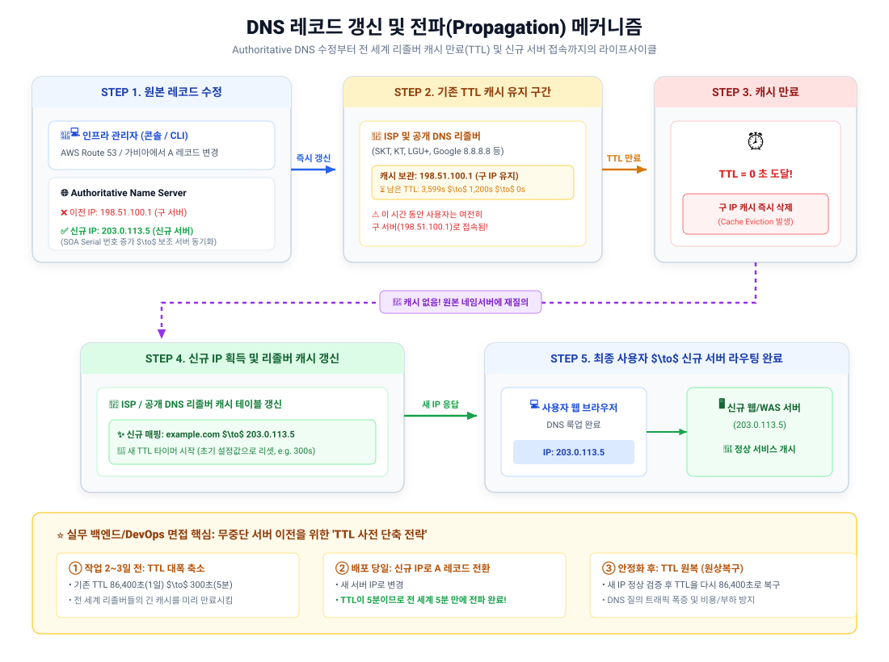
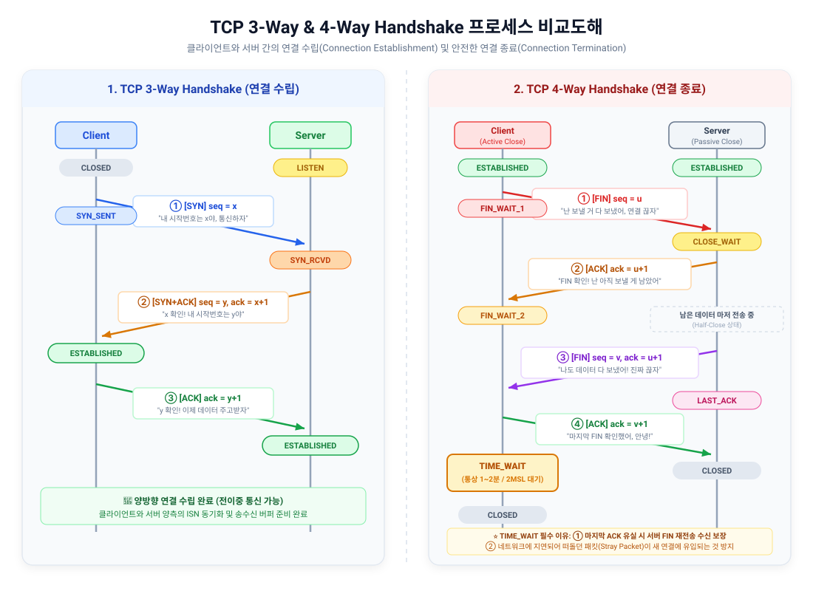

# 6주차 네트워크 모의면접 핵심 정리 & 면접관 체크리스트

이 문서는 **면접자**에게는 본인의 학습 노트(Lecture, Deep Dive, 실무 프로젝트)를 바탕으로 체화된 직관적인 답변 지침을 제공하고, **면접관**에게는 지원자의 네트워크 프로토콜 이해도와 실무 인프라 트러블슈팅 능력을 정밀하게 검증할 수 있는 표준 체크리스트 및 꼬리 질문 가이드입니다.

---

### 1. 프록시 서버의 기능에 대해 설명해 주세요.
> **질문:** 프록시 서버의 기능에 대해 설명해 주세요.

**🎯 면접관 필수 체크 키워드:**
*   [ ] **프록시(Proxy)의 기본 정의:** 클라이언트와 서버 사이에서 중계자(대리인) 역할을 하여 요청과 응답을 대신 전달하는 서버
*   [ ] **포워드 프록시 (Forward Proxy):** 클라이언트 앞단에 위치하여 클라이언트의 실제 IP 은닉, 사내망 보안 및 외부 웹 필터링, 아웃바운드 캐싱 수행
*   [ ] **리버스 프록시 (Reverse Proxy):** 웹 서버 앞단에 위치하여 서버의 실제 IP 은닉, 부하 분산(Load Balancing), SSL/TLS 종단(Termination), 정적 콘텐츠 캐싱 및 압축 수행
*   [ ] **CORS 우회 원리 (브라우저 vs 서버 통신):** 브라우저는 프록시를 동일 출처로 인식하여 CORS 검사를 통과하며, 프록시와 원본 서버 간의 서버 대 서버 통신에는 브라우저 CORS 정책이 적용되지 않음
*   [ ] **실무 솔루션 및 헤더 처리:** Nginx, HAProxy, Envoy / `X-Forwarded-For`, `X-Real-IP` 주입

**💡 핵심 지식 포인트:**
*   **🗣️ 내 언어로 말하는 한줄정리:**
    > "프록시 서버는 클라이언트와 서버 사이에서 요청과 응답을 대신 중계해 주는 '대리인(심부름꾼)' 서버입니다. 클라이언트 편에 서서 내 IP를 숨기고 사내망 보안을 지키는 **포워드 프록시**와, 서버 앞단에 서서 백엔드를 보호하고 부하 분산과 캐싱을 맡는 **리버스 프록시**로 나뉩니다."
*   **🛠️ 내 프로젝트 & 실무(Deep Dive 2주차) 연결:**
    *   **Fetch API 모델 추론 시 CORS 우회 해결책:** 브라우저에서 외부 AI 모델 서버로 직접 API 요청을 날리면 `Scheme://Host:Port` 출처 불일치로 CORS 에러가 발생합니다. 이때 중간에 **경량 프록시 서버(`proxy_server.py`)**를 두면, 브라우저는 프록시를 같은 출처로 인식해 요청을 보내고, 프록시가 모델 서버로 요청을 중계합니다. **서버 간 통신에는 브라우저의 CORS 정책이 전혀 개입하지 않으므로** 수정 권한이 없는 외부 API 통신 시 가장 확실한 우회 전략이 됩니다.
    *   **Nginx 리버스 프록시와 IP 유실 방지:** 백엔드(FastAPI) 앞에 Nginx를 리버스 프록시로 두면 FastAPI 컨테이너는 클라이언트 IP 대신 Nginx의 내부 IP를 보게 됩니다. 이를 방지하기 위해 `proxy_set_header X-Forwarded-For $proxy_add_x_forwarded_for;` 설정을 반드시 주입해야 접속 로그 및 보안 감사에서 원본 클라이언트 IP를 식별할 수 있습니다.
*   **포워드 프록시 vs 리버스 프록시의 본질적 차이:**
    *   **포워드 프록시 (Forward Proxy - 클라이언트의 대리인):**
        *   *위치:* 클라이언트와 인터넷 사이 (클라이언트 내부망).
        *   *역할:* 클라이언트가 웹 서버로 요청을 보낼 때, 프록시가 먼저 요청을 받아 서버에 전달.
        *   *주요 목적:* 
            1.  **클라이언트 익명성 보장:** 웹 서버는 프록시의 IP만 보게 되므로 내부 사용자의 IP를 감춤.
            2.  **보안 및 접근 제어:** 사내망에서 특정 유해 사이트나 비업무 사이트 접속을 차단.
            3.  **캐싱(Caching):** 자주 방문하는 외부 사이트 리소스를 저장해 두어 네트워크 대역폭 절약 및 응답 가속.
    *   **리버스 프록시 (Reverse Proxy - 서버의 대리인):**
        *   *위치:* 인터넷과 백엔드 웹 서버 군 사이 (서버 인프라망/DMZ).
        *   *역할:* 사용자는 리버스 프록시를 실제 웹 서버로 인식하고 요청을 보내며, 프록시가 내부 백엔드 서버(WAS)로 요청을 배분.
        *   *주요 목적:*
            1.  **백엔드 서버 은닉 및 보안:** 실제 서비스 서버들의 사설 IP와 네트워크 구성을 외부에 노출하지 않아 침투 공격 방어.
            2.  **부하 분산 (Load Balancing):** 여러 대의 백엔드 서버로 트래픽을 분산 전달.
            3.  **SSL/TLS 종단 (SSL Termination):** 무거운 암복호화 연산을 프록시가 전담하여 백엔드 애플리케이션 서버의 CPU 부하 경감.
            4.  **캐싱 및 압축:** HTML, 이미지 등 정적 리소스를 캐싱하고 gzip/brotli 압축을 적용해 응답 속도 극대화.

**🔍 심층 꼬리 질문 & 대응 가이드 (면접관용):**
*   **Q1. "Nginx를 리버스 프록시로 두고 SSL Termination(종단)을 구성했을 때의 장점과 보안적 주의점은 무엇인가요?"**
    *   👉 **답변 포인트:** 클라이언트와 Nginx 사이의 무거운 SSL/TLS 핸드셰이크 및 대칭키 암복호화 연산을 Nginx가 전담하므로, 내부 백엔드 애플리케이션(FastAPI/Uvicorn)은 암호화되지 않은 순수 HTTP 통신만 처리하여 CPU 자원을 비즈니스 로직에 집중할 수 있습니다. 또한 인증서 갱신을 Nginx 한 곳에서만 관리하면 되므로 운영 효율이 극대화됩니다. 다만, Nginx와 내부 백엔드 서버 간의 내부망 트래픽이 평문(Plaintext)으로 흐르므로, 제로 트러스트(Zero Trust) 환경이나 금융권 규정 준수를 위해서는 내부망 통신도 mTLS(Mutual TLS)로 암호화해야 합니다.
*   **Q2. "CORS 에러를 해결할 때 백엔드 코드의 CORS 미들웨어 수정과 프록시 서버 구축 중 어떤 기준을 가지고 선택하나요?"**
    *   👉 **답변 포인트:** 내가 직접 개발하고 운영하는 백엔드 서버라면 FastAPI의 `CORSMiddleware`처럼 서버 내부에서 `Access-Control-Allow-Origin` 응답 헤더를 선언하는 것이 인프라 비용 없이 코드 몇 줄로 끝나 가장 간단하고 안전합니다. 반면 타사 결제 API나 수정 불가능한 외부 AI 모델 추론 API를 호출해야 할 때는 서버 측 헤더를 바꿀 수 없으므로, 클라이언트 측에서 자체 프록시 서버를 구축하여 브라우저의 출처 제약을 우회하는 방식을 선택해야 합니다.

**📚 필수 핵심 용어 해설:**
*   **포워드 프록시 (Forward Proxy):** 클라이언트를 대신하여 외부 인터넷과 통신하는 대리 서버로, 클라이언트의 IP 은닉과 사내망 보안 필터링에 주로 활용됨.
*   **리버스 프록시 (Reverse Proxy):** 서버의 앞단에서 클라이언트 요청을 맞이하는 관문 서버로, 서버 보안, 부하 분산, SSL 종단, 캐싱을 담당함.
*   **SSL Termination (SSL 종단):** 암호화된 HTTPS 트래픽을 리버스 프록시 레벨에서 복호화하여 내부 서버에는 일반 HTTP로 전달하는 기법.

---

### 2. URI, URL, URN에 대해 설명해 주세요.
> **질문:** URI, URL, URN에 대해 설명해 주세요.

**🎯 면접관 필수 체크 키워드:**
*   [ ] **포함 관계:** URI가 최상위 개념이며, URL과 URN은 URI의 하위 분류 ($\text{URI} = \text{URL} \cup \text{URN}$)
*   [ ] **URI (Uniform Resource Identifier):** 인터넷 상의 자원을 고유하게 식별하기 위한 표준화된 식별 체계의 총칭
*   [ ] **URL (Uniform Resource Locator):** 자원이 '어디에 있는지' 물리적/논리적 위치(네트워크 경로)와 접근 프로토콜을 명시
*   [ ] **URN (Uniform Resource Name):** 자원의 위치와 독립적으로 부여된 영구적이고 고유한 '이름' (위치가 바뀌어도 식별자 불변)
*   [ ] **URL의 6대 구성 요소:** Scheme, Host, Port, Path, Query String, Fragment
*   [ ] **Same-Origin(동일 출처) 판별 기준:** URL의 `Scheme`, `Host`, `Port` 3가지가 완전히 일치해야 동일 출처로 판별

**💡 핵심 지식 포인트:**
*   **🗣️ 내 언어로 말하는 한줄정리:**
    > "URI가 인터넷 자원을 가리키는 '최상위 식별자(주민등록증 체계)'라면, 자원이 실제로 어디에 위치하는지 주소와 프로토콜까지 알려주는 것이 **URL**(집 주소)이고, 위치가 바뀌어도 변하지 않는 고유한 이름이 **URN**(이름)입니다. 즉, 모든 URL은 URI이지만 모든 URI가 URL인 것은 아닙니다."
*   **🛠️ 내 프로젝트 & 실무(Deep Dive 2주차 / Docker 배포) 연결:**
    *   **동일 출처(Same Origin) 정책과의 연결:** 브라우저가 보안상 출처를 비교할 때 바로 이 URL의 헤더 정보를 검사합니다. URL의 `Scheme(프로토콜)`, `Host(도메인/IP)`, `Port(포트)` 중 단 하나라도 다르면 완전히 다른 컴퓨터(출처)로 취급하여 요청이나 응답을 차단합니다.
    *   **Docker EC2 배포 주소의 URL 분석:**
        `http://{EC2 퍼블릭 IP}:{서비스 포트}/docs`
        - `Scheme`: 통신 규약 (`http`)
        - `Host`: 서버의 네트워크 식별자 (`EC2 퍼블릭 IP`)
        - `Port`: 서비스 바인딩 포트 (`8000`)
        - `Path`: 내부 API 문서 경로 (`/docs`)
*   **🎨 단 하나의 실생활 예시로 끝내는 URI / URL / URN (웹툰 1컷 이미지 파일):**
    *   **대상 자원:** 웹툰 '신의 탑 600화 1번째 컷 그림(JPG)'
    *   **URN (이름 - 영구 불변):** `urn:naver:webtoon:tower-of-god:ep600:cut01`
        *   그림이 네이버 서버에 있든, 내 폰 캐시에 있든, 백업 스토리지로 가든 **'신의 탑 600화 1번 컷'이라는 고유한 주민등록번호는 영원히 불변**. (단, 위치 정보가 없어 이것만으로는 브라우저가 다운로드 불가)
    *   **URL (위치 - 네트워크 경로):** `https://image-comic.pstatic.net/webtoon/183559/600/01.jpg`
        *   프로토콜(`https`), 네이버 이미지 CDN 서버 호스트(`image-comic.pstatic.net`), 폴더 경로(`/webtoon/.../01.jpg`)를 명시하여 **브라우저가 실제로 찾아가서 다운로드할 수 있는 주소**. (단, 서버를 이전해 경로가 바뀌면 404 엑박 발생)
    *   **URI (최상위 식별자):**
        *   해당 그림을 고유하게 식별할 수 있다면 **이름(URN)이든 실제 위치(URL)든 모두 URI**에 속함. 따라서 위 이미지 주소는 URL이면서 동시에 URI임 ($\text{URI} = \text{URL} \cup \text{URN}$).
*   **URL의 구조적 분해:**
    ```
    https://www.example.com:443/users/profile?id=10&page=2#reviews
    └─┬─┘   └──────┬──────┘ └─┬─┘ └──────┬──────┘ └─────┬─────┘ └──┬──┘
    Scheme       Host       Port       Path        Query String  Fragment
    ```
    1.  **Scheme (프로토콜):** 자원에 접근하기 위한 통신 규약 (`https`, `http`, `ftp`).
    2.  **Host (호스트):** 자원을 호스팅하고 있는 서버의 도메인 이름 또는 IP 주소.
    3.  **Port (포트):** 서버 내의 접속 포트 번호 (HTTP=80, HTTPS=443은 통상 생략).
    4.  **Path (경로):** 서버 내에서 자원이 위치한 계층적 디렉터리 경로.
    5.  **Query String (쿼리 스트링):** `?` 뒤에 `key=value` 쌍으로 서버에 전달하는 동적 파라미터.
    6.  **Fragment (프래그먼트 / 해시):** `#` 뒤에 붙으며, 서버로 전송되지 않고 클라이언트 브라우저가 특정 HTML 앵커(위치)로 스크롤 이동하기 위한 식별자.

**🔍 심층 꼬리 질문 & 대응 가이드 (면접관용):**
*   **Q1. "RESTful API 설계 시 Path Variable(파라미터)과 Query Parameter는 각각 어떤 상황에 쓰는 것이 적합한가요?"**
    *   👉 **답변 포인트:** **Path Variable**(`/users/123`)은 어떤 자원을 식별하거나 특정 리소스 자체를 지정할 때 사용합니다(식별의 용도). 반면 **Query Parameter**(`/users?page=1&sort=desc&role=admin`)는 자원을 식별한 후 해당 리소스들을 정렬(Sort), 필터링(Filter), 페이징(Pagination)하는 등 보조적인 제어 정보를 전달할 때 사용하는 것이 표준 REST 설계 원칙입니다.
*   **Q2. "URL에서 Fragment(`#section-1`)는 서버로 전송되는 HTTP 요청 패킷에 포함되나요?"**
    *   👉 **답변 포인트:** 포함되지 않습니다. Fragment는 순수하게 클라이언트(브라우저) 내부에서만 소비되는 식별자입니다. 브라우저는 서버로 HTTP 요청 패킷을 만들 때 `#` 뒷부분을 완전히 잘라내고 요청을 보내며, 서버로부터 HTML을 수신한 뒤 브라우저 엔진이 해당 `id`를 가진 DOM 엘리먼트로 화면을 스크롤하는 데 사용합니다.

**📚 필수 핵심 용어 해설:**
*   **URI (Uniform Resource Identifier):** 인터넷에 있는 자원을 나타내는 유일한 주소 체계로, 자원의 위치(URL)나 이름(URN)을 모두 포괄하는 상위 개념.
*   **URN (Uniform Resource Name):** 위치와 프로토콜에 독립적으로 자원에 부여된 영구적인 고유 이름 (예: `urn:isbn:...`).

---

### 3. DNS에 대해 설명해 주세요.
> **질문:** DNS에 대해 설명해 주세요.

**🎯 면접관 필수 체크 키워드:**
*   [ ] **DNS의 정의:** 사람이 기억하기 쉬운 도메인 이름(예: `google.com`)을 컴퓨터가 통신할 수 있는 IP 주소(예: `142.250.190.46`)로 상호 변환해 주는 계층적 분산 데이터베이스 시스템
*   [ ] **DNS 계층 구조:** Root 네임서버(`.`) $\to$ TLD 네임서버(`.com`) $\to$ SLD / Authoritative 네임서버
*   [ ] **Recursive Resolver (재귀적 해석기):** 클라이언트 대신 DNS 계층 구조를 순차 탐색하여 최종 IP를 찾아오는 주체 (ISP DNS, 8.8.8.8, 1.1.1.1)
*   [ ] **주요 DNS 레코드 타입:** `A`(IPv4), `AAAA`(IPv6), `CNAME`(도메인 별칭), `MX`(메일), `TXT`(SPF/도메인 인증)
*   [ ] **캐싱과 TTL (Time To Live):** DNS 응답 속도 최적화 및 갱신 지연 간의 트레이드오프

**💡 핵심 지식 포인트:**
*   **🗣️ 내 언어로 말하는 한줄정리:**
    > "DNS는 사람이 외우기 쉬운 도메인 주소를 컴퓨터가 실제로 통신할 수 있는 숫자로 된 IP 주소로 상호 변환해 주는 '전 세계 분산 전화번호부 시스템'입니다."
*   **🛠️ 내 프로젝트 & 실무(Linux / EC2 배포) 연결:**
    *   **Linux `nslookup` 도구:** Linux 환경에서 도메인이 정상적으로 IP에 매핑되어 있는지 확인하거나, 역으로 IP의 도메인을 조회할 때 `nslookup domain.com` 명령어로 네임서버 질의 결과를 즉시 검증합니다.
    *   **AWS EC2 인스턴스와 도메인 연결:** EC2 인스턴스를 재시작하면 고정 IP(Elastic IP)가 없을 경우 퍼블릭 IP와 퍼블릭 DNS가 매번 변경됩니다. 따라서 고정 IP를 할당한 뒤, 가비아나 AWS Route 53 같은 권한 있는 네임서버(Authoritative DNS)에 `A` 레코드로 내 도메인(`api.service.com`)을 고정 IP에 1:1 매핑해 주어야 외부 사용자가 안정적으로 접속할 수 있습니다.
*   **📊 DNS 레코드 갱신 및 전파(Propagation) 메커니즘 도해:**
    

*   **DNS 쿼리가 진행되는 5단계 계층적 해석 과정:**
    1.  **로컬 캐시 확인:** 브라우저 캐시 $\to$ OS 호스트 파일(`hosts`) 및 OS DNS 캐시를 먼저 확인하여 주소가 있으면 즉시 반환.
    2.  **Recursive DNS Resolver 전달:** 캐시에 없으면 사용자가 설정한 로컬 DNS 서버(ISP 통신사 DNS, Google Public DNS 등)로 요청.
    3.  **Root DNS Server 조회:** 리졸버가 전 세계에 13개 IP 묶음으로 존재하는 루트 네임서버(`.`)에 질의 $\to$ 루트 서버는 `.com`을 관리하는 **TLD 네임서버 IP**를 회신.
    4.  **TLD DNS Server 조회:** 리졸버가 `.com` TLD 서버에 질의 $\to$ `google.com`의 실제 레코드를 쥐고 있는 **Authoritative 네임서버 IP**를 회신.
    5.  **Authoritative DNS Server 조회:** 최종 네임서버(AWS Route 53 등)에 질의 $\to$ 최종 목적지 호스트의 실제 `A` 레코드(IPv4 주소)를 획득하여 브라우저에 전달 및 캐싱.
*   **💡 실무 프로토콜 팁:**
    *   DNS는 기본적으로 빠른 속도와 적은 오버헤드를 위해 **UDP 포트 53번**을 사용하여 1회성 요청-응답을 수행합니다. 단, DNS 응답 데이터의 크기가 512바이트를 초과하거나(DNSSEC), 영역 전송(Zone Transfer)을 할 때는 신뢰성이 필요하므로 **TCP 포트 53번**으로 자동 전환(Fallback)됩니다.

**🔍 심층 꼬리 질문 & 대응 가이드 (면접관용):**
*   **Q1. "CNAME 레코드와 A 레코드의 결정적 차이는 무엇이며, 루트 도메인(Apex Domain, e.g. `example.com`)에는 왜 CNAME을 쓰지 못하나요?"**
    *   👉 **답변 포인트:** A 레코드는 도메인을 고정 IP로 직접 매핑하지만, CNAME은 도메인을 다른 도메인으로 리다이렉션하듯 매핑하여 이중 DNS 룩업이 일어납니다. DNS 표준(RFC 1034)에 따르면 루트 도메인은 도메인의 시작점이므로 `NS`, `SOA` 등 필수 레코드가 반드시 공존해야 하는데, CNAME 레코드는 다른 모든 레코드와 동일한 노드에 공존할 수 없다는 배타적 제약이 있습니다. 따라서 루트 도메인에는 CNAME을 달 수 없으며, AWS Route 53의 **Alias(별칭) 레코드**나 Cloudflare의 **CNAME Flattening** 같은 독자적 가상 A 레코드 기술을 써야 로드 밸런서와 연동할 수 있습니다.
*   **Q2. "서버 IP를 변경해야 할 때, DNS의 TTL(Time To Live)을 어떻게 운영하는 것이 무중단 전환에 안전한가요?"**
    *   👉 **답변 포인트:** 전 세계의 리졸버와 사용자가 이전 IP를 캐싱하고 있으므로, 작업 며칠 전에 미리 도메인의 TTL을 기존 86400초(1일)에서 300초(5분) 수준으로 낮춰둡니다. 이후 캐시가 만료된 시점에 안전하게 새 IP로 A 레코드를 전환하고, 정상 동작이 검증되면 다시 TTL을 늘려 DNS 서버의 질의 부하를 낮추는 것이 표준 운영 절차입니다.

**📚 필수 핵심 용어 해설:**
*   **Authoritative DNS Server (권한 있는 네임서버):** 특정 도메인에 대한 최종적인 실제 IP 매핑 정보(원본 레코드)를 영구적으로 저장하고 응답하는 공식 서버.
*   **TTL (Time To Live):** DNS 레코드가 클라이언트나 중간 리졸버 캐시에 보관될 수 있는 유효 시간(초 단위).

---

### 4. TCP와 UDP 방식의 차이점에 대해 설명해 주세요.
> **질문:** TCP와 UDP 방식의 차이점에 대해 설명해 주세요.

**🎯 면접관 필수 체크 키워드:**
*   [ ] **계층 및 프로토콜 위치:** OSI 4계층(전송 계층, Transport Layer)에서 동작하는 두 가지 표준 프로토콜
*   [ ] **TCP (Transmission Control Protocol):** 연결 지향적(3-way handshake), 신뢰성 보장(확인 응답 ACK, 순서 보장, 재전송), 흐름 제어 및 혼잡 제어 탑재
*   [ ] **UDP (User Datagram Protocol):** 비연결형, 비신뢰성(Best-effort 전송), 핸드셰이크 없음, 순서 미보장, 극도로 가벼운 헤더(8바이트)와 빠른 전송 속도
*   [ ] **신뢰성 vs 지연 시간(Latency)의 트레이드오프:** 패킷 손실 시 재전송에 의한 지연(TCP의 HoL Blocking) vs 패킷이 유실되어도 즉시 다음 프레임 전송(UDP)
*   [ ] **대표적 사용처:** TCP(HTTP/1.1, HTTP/2, 이메일, 파일 전송) vs UDP(실시간 스트리밍, 온라인 게임, DNS, HTTP/3 QUIC)

**💡 핵심 지식 포인트:**
*   **🗣️ 내 언어로 말하는 한줄정리:**
    > "TCP는 대화하기 전에 연결을 먼저 맺고(3-way handshake) 중간에 말이 끊기면 다시 물어봐서 100% 신뢰성을 보장하는 **전화 통화** 같은 방식이고, UDP는 사전 연결 없이 패킷을 즉시 쏘아 보내 속도가 매우 빠르지만 중간 손실을 감수하는 **우편/생방송** 같은 방식입니다."
*   **🛠️ 내 프로젝트 & 실무(Linux / 네트워크 진단) 연결:**
    *   **Linux 소켓 확인 도구 `ss`:** Linux 환경에서 `ss -t -a`(TCP 소켓 상태)와 `ss -u -a`(UDP 소켓 상태) 명령어를 사용해, 현재 서버가 어떤 프로토콜과 포트에서 LISTEN 중이고 어떤 클라이언트와 연결(ESTABLISHED)되어 있는지 소켓 상태를 실시간 진단합니다.
    *   **HTTP/3의 대전환 (QUIC):** 웹 서비스에서 TCP의 신뢰성은 필수적이었지만, 패킷 하나가 유실되면 전체 데이터 스트림이 멈춰버리는 **Head-of-Line Blocking** 문제가 심각했습니다. 최신 HTTP/3는 TCP를 버리고 UDP 위에 애플리케이션 레벨의 신뢰성 로직을 얹은 **QUIC**을 도입하여 지연 시간을 획기적으로 줄였습니다.
*   **TCP vs UDP 핵심 특성 상세 비교:**
    | 구분 | TCP (Transmission Control Protocol) | UDP (User Datagram Protocol) |
    | :--- | :--- | :--- |
    | **연결 방식** | **연결 지향적 (Connection-oriented)**<br>(3-way handshake로 가상 회선 수립) | **비연결형 (Connectionless)**<br>(사전 연결 수립 없이 패킷 즉시 발송) |
    | **신뢰성** | **100% 신뢰성 보장** (패킷 유실 시 재전송, Checksum) | **신뢰성 미보장 (Best-effort)** (유실 감지 및 복구 없음) |
    | **패킷 순서** | **순서 엄격 보장** (시퀀스 번호 기반 수신측 재조립) | **순서 미보장** (도착 순서가 뒤바뀔 수 있음) |
    | **전송 제어 기능** | **흐름 제어** (Sliding Window), **혼잡 제어** (Slow Start 등) | **전송 제어 기능 없음** (단순 송출) |
    | **헤더 크기** | 최소 **20바이트** ~ 최대 60바이트 (무거움) | 고정 **8바이트** (극도로 가벼움) |
    | **전송 단위** | **세그먼트 (Segment)** (바이트 스트림 기반) | **데이터그램 (Datagram)** (독립적 패킷 경계 유지) |
*   **TCP의 2대 지능형 제어 기법:**
    1.  **흐름 제어 (Flow Control):** 송신측과 수신측의 속도 차이를 맞추기 위해, 수신측이 자신의 남은 버퍼 용량(Window Size)을 송신측에 알려주어 수신측 버퍼 오버플로를 방지하는 기법 (슬라이딩 윈도우).
    2.  **혼잡 제어 (Congestion Control):** 송신측과 네트워크 라우터망 사이의 혼잡도를 감지하여, 네트워크가 감당할 수 있는 패킷 전송량을 조절함으로써 네트워크 붕괴를 방지하는 기법 (Slow Start, Fast Retransmit 등).

**🔍 심층 꼬리 질문 & 대응 가이드 (면접관용):**
*   **Q1. "TCP에서 패킷 손실이 발생했을 때 나타나는 'Head-of-Line (HoL) Blocking' 현상이란 무엇인가요?"**
    *   👉 **답변 포인트:** TCP는 수신측에서 바이트 스트림의 순서를 엄격히 보장하기 위해, 앞선 번호의 패킷이 도착하지 않으면 그 뒤에 이미 도착한 패킷들이 정상이어도 애플리케이션으로 올려보내지 않고 버퍼에서 대기시킵니다. 즉, **단 1개의 유실된 패킷을 재전송받아 채울 때까지 뒤따르는 모든 데이터의 처리가 줄줄이 막혀 지연이 폭증하는 병목 현상**을 의미합니다.
*   **Q2. "UDP는 신뢰성을 보장하지 않는데, 어떻게 HTTP/3나 대규모 온라인 게임에서는 데이터 유실 없이 UDP를 쓸 수 있나요?"**
    *   👉 **답변 포인트:** UDP 프로토콜 자체가 신뢰성을 주지 않을 뿐, **애플리케이션 계층(L7)에서 필요한 신뢰성 메커니즘을 직접 구현**하여 사용하기 때문입니다. HTTP/3의 기반인 QUIC 프로토콜은 패킷에 자체 시퀀스 번호와 재전송 로직을 두어 스트림별 독립적 신뢰성을 구현함으로써, TCP의 무거운 커널 종속성과 HoL 블로킹을 우회하면서도 필요한 신뢰성을 완벽히 확보합니다.

**📚 필수 핵심 용어 해설:**
*   **슬라이딩 윈도우 (Sliding Window):** TCP 흐름 제어에서 수신측이 확인 응답(ACK)을 보내지 않아도 송신측이 한 번에 연속으로 전송할 수 있는 패킷의 허용 범위.
*   **QUIC (Quick UDP Internet Connections):** 구글이 개발하고 IETF가 표준화한 UDP 기반의 전송 계층 프로토콜로, 핸드셰이크 지연 단축 및 멀티플렉싱 독립성을 지원함.

---

### 5. 웹 서버에 대해 설명해 주세요.
> **질문:** 웹 서버에 대해 설명해 주세요.

**🎯 면접관 필수 체크 키워드:**
*   [ ] **웹 서버 (Web Server)의 기본 정의:** HTTP/HTTPS 프로토콜을 기반으로 클라이언트의 요청을 받아 **정적 리소스(HTML, CSS, JS, 이미지 등)**를 제공하는 서버 소프트웨어
*   [ ] **웹 서버 (Web Server) vs WAS (Web Application Server)의 대조:**
    *   Web Server: Nginx, Apache HTTP Server $\to$ 정적 콘텐츠 전송, 리버스 프록시, SSL 종단, 로드 밸런싱 특화
    *   WAS: Uvicorn, Gunicorn, Tomcat $\to$ DB 조회, 비즈니스 로직 연산 등 **동적 콘텐츠(Dynamic Contents)** 생성 특화
*   [ ] **실무 분리 아키텍처(Web Server 앞단 + WAS 뒷단) 도입 이유:**
    1.  서버 부하 분산 및 정적 리소스 초고속 전송 (Zero-Copy)
    2.  보안 강화 (WAS 직접 노출 차단, 사설망 격리)
    3.  무중단 배포 (Rolling, Blue-Green 배포 라우팅 제어)
*   [ ] **Apache vs Nginx의 동시성 모델:** 다중 프로세스/스레드 모델(Apache의 C10K 한계) vs 비동기 논블로킹 이벤트 루프 모델(Nginx의 고성능)

**💡 핵심 지식 포인트:**
*   **🗣️ 내 언어로 말하는 한줄정리:**
    > "웹 서버(Nginx)는 HTML, CSS, 이미지 같은 **정적 리소스**를 초고속으로 서빙하고 보안·리버스 프록시 문지기 역할을 하는 서버이고, WAS(Uvicorn/FastAPI)는 비즈니스 로직 연산과 DB 조회를 수행해 **동적 데이터**를 생성하는 일꾼 서버입니다."
*   **🛠️ 내 프로젝트 & 실무(DevOps / Docker 배포) 연결:**
    *   **Nginx + FastAPI(Uvicorn) 실무 아키텍처:**
        Docker 컨테이너로 FastAPI 레시피 챗봇 프로젝트를 EC2에 배포할 때, WAS인 Uvicorn에 직접 사용자가 붙게 하지 않고 앞단에 Nginx 웹 서버를 리버스 프록시로 배치합니다.
        ```
        [ 사용자 브라우저 ] ──(HTTPS:443)──▶ [ Nginx 웹 서버 ] ──(내부 HTTP:8000)──▶ [ Docker Container (FastAPI/Uvicorn) ]
        ```
    *   **분리 배포의 3가지 실무적 이점:**
        1.  *정적 파일 캐싱:* 이미지나 정적 문서는 무거운 파이썬 워커(Uvicorn)를 깨우지 않고 Nginx가 즉시 반환.
        2.  *SSL Termination:* 무거운 HTTPS 암복호화 연산을 Nginx가 전담하여 파이썬 앱의 CPU 낭비 방지.
        3.  *무중단 배포:* 컨테이너를 새 버전으로 교체할 때 Nginx가 헬스체크를 수행하여 끊김 없이 트래픽 전환.
*   **Web Server vs WAS의 기능적 분리 구조:**
    ```
    [ Client ] ──(HTTPS)──▶ [ Web Server (Nginx) ] ──(Proxy/HTTP)──▶ [ WAS (Uvicorn/Tomcat) ] ──▶ [ Database ]
                                    │                                           │
                           정적 리소스 즉시 반환                         비즈니스 로직 & DB 연동
                         (HTML, CSS, JS, Images)                          (동적 데이터 연산)
    ```
*   **Apache HTTP Server vs Nginx 아키텍처 비교:**
    *   **Apache (Process/Thread per Connection):** 클라이언트 요청 1개당 스레드나 프로세스 1개를 할당. 구조가 직관적이지만 접속자가 수만 명으로 급증하면 메모리 고갈과 극심한 컨텍스트 스위칭으로 서버가 뻗는 **C10K 문제**에 직면.
    *   **Nginx (Event-Driven Non-blocking):** 적은 수의 워커 프로세스(CPU 코어 수만큼)가 비동기 이벤트 루프를 돌며 수만 개의 동시 커넥션을 가볍게 처리. 메모리 사용량이 극히 적고 대규모 트래픽 처리에 압도적으로 유리.

**🔍 심층 꼬리 질문 & 대응 가이드 (면접관용):**
*   **Q1. "WAS(예: Uvicorn이나 Tomcat)만으로도 정적 파일 처리가 가능한데, 왜 굳이 앞에 Nginx 같은 웹 서버를 따로 두는 분리 아키텍처를 채택하나요?"**
    *   👉 **답변 포인트:** 크게 3가지 이유 때문입니다. 첫째, **자원 최적화**입니다. Nginx는 C언어로 작성되어 OS 커널의 `sendfile` 시스템콜을 사용해 유저 메모리 복사 없이 초고속으로 정적 파일을 서빙하므로, 무거운 WAS 스레드가 정적 파일 전송에 낭비되는 것을 막습니다. 둘째, **보안**입니다. DB 연결 정보가 있는 WAS를 사설망에 숨기고 웹 서버만 외부에 노출하여 침투 공격을 1차 방어합니다. 셋째, **무중단 배포**입니다. 여러 대의 WAS 중 일부를 순차적으로 재시작할 때 Nginx가 헬스체크를 통해 트래픽을 동적으로 우회시킴으로써 서비스 중단 없이 배포할 수 있습니다.
*   **Q2. "Nginx에서 `sendfile on;` 설정이 정적 파일 서빙 속도를 비약적으로 높여주는 운영체제적 원리는 무엇인가요?"**
    *   👉 **답변 포인트:** 일반적인 파일 전송은 디스크 $\to$ OS 커널 버퍼 $\to$ 유저 애플리케이션 메모리 $\to$ OS 소켓 버퍼 $\to$ 네트워크 카드로 총 4번의 메모리 복사와 4번의 컨텍스트 스위칭을 거칩니다. 반면 `sendfile`은 Zero-Copy 기술을 사용하여 디스크 데이터를 유저 메모리로 끌어올리지 않고 **커널 공간 내부에서 네트워크 소켓으로 직접 다이렉트 전송**하므로, CPU 점유율과 메모리 복사 오버헤드를 0에 가깝게 줄여줍니다.

**📚 필수 핵심 용어 해설:**
*   **WAS (Web Application Server):** 정적 파일 외에 DB 조회, 트랜잭션 등 복잡한 비즈니스 로직을 수행하여 동적인 데이터를 생성해 내는 미들웨어 엔진 (예: Tomcat, Uvicorn).
*   **Zero-Copy (`sendfile`):** CPU가 데이터를 유저 공간 메모리로 복사하지 않고 커널 공간 내에서 디스크에서 네트워크로 직접 전송하는 고성능 I/O 기법.

---

### 6. OSI 7계층과 TCP/IP 4계층에 대해 설명하고, 각 계층의 역할을 말해 주세요.
> **질문:** OSI 7계층과 TCP/IP 4계층에 대해 설명하고, 각 계층의 역할을 말해 주세요.

**🎯 면접관 필수 체크 키워드:**
*   [ ] **계층화의 본질적 목적:** 복잡한 네트워크 통신을 독립된 단계로 모듈화하여 표준화, 유지보수성, 이기종 간 호환성 확보 및 트러블슈팅의 용이성
*   [ ] **OSI 7계층 vs TCP/IP 4계층 매핑:**
    *   응용/표현/세션 계층 $\to$ **TCP/IP 응용 계층 (Application)**
    *   전송 계층 $\to$ **TCP/IP 전송 계층 (Transport)**
    *   네트워크 계층 $\to$ **TCP/IP 인터넷 계층 (Internet)**
    *   데이터링크/물리 계층 $\to$ **TCP/IP 네트워크 인터페이스 계층 (Network Access)**
*   [ ] **각 계층의 프로토콜 데이터 단위 (PDU):**
    *   L4 (세그먼트 / 데이터그램), L3 (패킷), L2 (프레임), L1 (비트 스트림)
*   [ ] **캡슐화(Encapsulation)와 역캡슐화(Decapsulation):** 송신 시 헤더 추가(포장) $\to$ 수신 시 헤더 제거(언패킹) 과정
*   [ ] **계층별 대표 식별 주소 및 장비:** L3(IP 주소, 라우터) vs L2(MAC 주소, 스위치)

**💡 핵심 지식 포인트:**
*   **🗣️ 내 언어로 말하는 한줄정리:**
    > "OSI 7계층과 TCP/IP 4계층은 복잡한 네트워크 통신을 독립된 단계로 표준화하여, 문제가 발생했을 때 문제의 원인을 아래부터 위로 빠르게 좁히고 모듈별로 해결할 수 있도록 설계한 '네트워크 계층 지도'입니다."
*   **🛠️ 내 프로젝트 & 실무(Linux 인프라 트러블슈팅) 연결:**
    *   **계층별 바텀업(Bottom-up) 실무 진단 순서:**
        1.  *L1/L2 (물리/데이터링크):* 랜선 물리적 연결 상태 및 이더넷 링크 확인 $\to$ Linux `ip link` / `ifconfig`
        2.  *L3 (네트워크/인터넷):* 로컬 게이트웨이 및 외부 통신 가능 여부 $\to$ `ping 8.8.8.8`, `traceroute`
        3.  *L4 (전송):* 내 서버의 서비스 포트가 열려 있는지, 방화벽(AWS 보안그룹)이 차단되었는지 $\to$ `ss -tuln`, `nc -zv {IP} {Port}`
        4.  *L7 (응용):* 도메인 주소 조회 및 웹 애플리케이션 정상 응답 여부 $\to$ `nslookup domain.com`, `curl -v http://localhost:8000/docs`
*   **OSI 7계층 및 TCP/IP 4계층 상세 매핑 구조:**
    ```
    [ OSI 7 Layer ]                    [ TCP/IP 4 Layer ]         [ PDU ]            [ 주요 프로토콜 / 장비 ]
    ─────────────────────────────────────────────────────────────────────────────────────────────────────────────
    7. 응용 (Application)      ──┐
    6. 표현 (Presentation)     ──┼──▶  1. 응용 (Application)       Data / Message     HTTP, DNS, TLS, SSH, FTP
    5. 세션 (Session)          ──┘
    ─────────────────────────────────────────────────────────────────────────────────────────────────────────────
    4. 전송 (Transport)        ────▶  2. 전송 (Transport)         Segment / Datagram TCP, UDP (Port 번호, L4 로드밸런서)
    ─────────────────────────────────────────────────────────────────────────────────────────────────────────────
    3. 네트워크 (Network)       ────▶  3. 인터넷 (Internet)         Packet             IP, ICMP, ARP (IP 주소, 라우터)
    ─────────────────────────────────────────────────────────────────────────────────────────────────────────────
    2. 데이터링크 (Data Link)   ──┐
                                ──┼──▶  4. 네트워크 인터페이스      Frame / Bit        이더넷, Wi-Fi (MAC 주소, L2 스위치,
    1. 물리 (Physical)         ──┘        (Network Access)                           케이블, 허브)
    ```
*   **각 계층별 핵심 역할:**
    1.  **응용 계층 (Application):** 사용자와 소프트웨어가 네트워크 서비스에 직접 접근하는 인터페이스 제공 (웹 브라우징, 이메일, SSH 등).
    2.  **전송 계층 (Transport):** 송신자와 수신자 프로세스 간의 **종단 간(End-to-End) 신뢰성 있는 데이터 전송** 보장. 포트(Port) 번호를 통해 어떤 프로세스(앱)에 데이터를 넘길지 식별.
    3.  **인터넷/네트워크 계층 (Network):** 논리적 주소인 **IP 주소**를 기반으로 패킷이 목적지 호스트까지 갈 수 있는 **최적의 경로를 설정(라우팅, Routing)**.
    4.  **네트워크 인터페이스 계층 (Data Link & Physical):** 동일한 물리적 네트워크(LAN) 내에서 물리적 주소인 **MAC 주소**를 기반으로 인접 노드 간의 안전한 프레임 전송 및 0과 1의 전기/광 신호 변환 담당.

**🔍 심층 꼬리 질문 & 대응 가이드 (면접관용):**
*   **Q1. "목적지 서버와 통신할 때 IP 주소만 있으면 되는데, 왜 L2 계층의 MAC 주소가 별도로 필요한가요?"**
    *   👉 **답변 포인트:** **IP 주소는 최종 목적지(서울에서 부산까지)를 가리키는 논리적 주소**이고, **MAC 주소는 다음 경유지 라우터(다음 톨게이트)로 가기 위한 물리적 식별자**이기 때문입니다. 인터넷은 여러 개의 독립된 로컬 네트워크(LAN)들이 라우터로 얽힌 구조입니다. 패킷이 최종 목적지 IP로 이동하는 동안, 물리적 링크를 한 홉(Hop)씩 건너갈 때마다 L2 프레임의 목적지 MAC 주소는 다음 인접 라우터의 MAC 주소로 계속 갱신되면서 전달됩니다. 이를 위해 IP 주소로 MAC 주소를 알아내는 **ARP(Address Resolution Protocol)**가 필수적으로 동작합니다.
*   **Q2. "L4 스위치와 L7 스위치의 라우팅 판단 기준의 차이는 무엇인가요?"**
    *   👉 **답변 포인트:** **L4 스위치**는 IP 헤더와 TCP/UDP 헤더(IP 주소와 Port 번호)까지만 분석하여 패킷을 분산하므로, 속도가 극도로 빠르지만 패킷 내부의 실제 콘텐츠 내용은 알지 못합니다. 반면 **L7 스위치**는 애플리케이션 계층인 HTTP 요청 헤더, 쿠키, URL 패스, 페이로드 본문까지 복호화하여 분석하므로, 특정 URL 경로(`/api` vs `/static`)나 로그인 사용자 세션에 따라 지능적으로 트래픽을 분기할 수 있습니다.

**📚 필수 핵심 용어 해설:**
*   **PDU (Protocol Data Unit):** 각 네트워크 계층에서 주고받는 데이터 단위의 공식 명칭 (L4: Segment, L3: Packet, L2: Frame).
*   **ARP (Address Resolution Protocol):** 논리적인 IP 주소를 기반으로 동일 네트워크 세그먼트 내에 있는 목적지의 물리적인 MAC 주소를 알아내기 위한 프로토콜.

---

### 7. TCP의 3-way handshake와 4-way handshake 과정에 대해 설명해 주세요.
> **질문:** TCP의 3-way handshake와 4-way handshake 과정에 대해 설명해 주세요.

**🎯 면접관 필수 체크 키워드:**
*   [ ] **3-way handshake의 목적:** 양방향 통신 채널의 송수신 가능 여부 검증 및 초기 순서 번호(ISN, Initial Sequence Number) 동기화
*   [ ] **3-way 단계:** `SYN` $\to$ `SYN + ACK` $\to$ `ACK` (상태: `LISTEN` $\to$ `SYN_SENT` $\to$ `SYN_RCVD` $\to$ `ESTABLISHED`)
*   [ ] **4-way handshake의 목적:** 양방향 연결을 안전하게 분리하여 종료하는 절차 (Half-Close 상태 지원)
*   [ ] **4-way 단계:** `FIN` $\to$ `ACK` $\to$ `FIN` $\to$ `ACK` (상태: `FIN_WAIT_1`, `CLOSE_WAIT`, `FIN_WAIT_2`, `LAST_ACK`, `TIME_WAIT`)
*   [ ] **TIME_WAIT 상태의 핵심 존재 이유:**
    1.  마지막 `ACK` 패킷 유실 시 상대방의 `FIN` 재전송 수신 및 재ACK 보장
    2.  네트워크에 지연되어 떠돌던 잉여 패킷(Stray Packet)이 새로운 연결과 뒤섞여 데이터가 오염되는 것을 방지 (2MSL 대기)

**💡 핵심 지식 포인트:**
*   **🗣️ 내 언어로 말하는 한줄정리:**
    > "3-way handshake는 데이터 전송 전에 '내 말 들려? 어 잘 들려, 내 말은 들려? 어 잘 들려' 하고 양방향 채널과 시작 번호(ISN)를 맞추는 **연결 수립 악수**이고, 4-way handshake는 서로 보낼 데이터를 마저 다 보내고 안전하게 연결을 끊는 **연결 종료 악수**입니다."
*   **🛠️ 내 프로젝트 & 실무(Linux 소켓 상태 진단) 연결:**
    *   **소켓 상태 확인 (`ss` 명령어):** 연결 수립 및 종료 과정에서 소켓이 어떤 상태에 머물러 있는지 Linux `ss -t -a` 명령어로 확인합니다. 비정상적으로 `CLOSE_WAIT`나 `TIME_WAIT` 상태가 과도하게 쌓여 있으면 로컬 포트 고갈로 신규 접속 장애가 발생합니다.
    *   **종료가 4단계인 이유 (Half-Close):** 클라이언트가 "난 보낼 데이터를 다 보냈다(FIN)"고 하더라도, 서버 측에서는 아직 클라이언트에게 보내야 할 데이터가 남아있을 수 있습니다. 따라서 서버는 일단 FIN에 대한 `ACK`만 먼저 보낸 뒤, 남은 잔여 데이터를 마저 다 전송하고 나서 비로소 자신의 `FIN`을 보냅니다.
*   **📊 TCP 핸드셰이크(3-Way & 4-Way) 시각화 도해:**
    

*   **TCP 3-way Handshake (연결 수립 절차):**
    ```
    [ Client ]                                                    [ Server ]
        │                                                             │ (LISTEN)
        │ ─── 1. [SYN] seq=x ───────────────────────────────────────▶ │ (SYN_RCVD)
        │      "내 시작 번호는 x야, 통신하자"                         │
        │                                                             │
        │ ◀── 2. [SYN+ACK] seq=y, ack=x+1 ─────────────────────────── │
        │      "x 잘 받았어(ack=x+1). 내 시작 번호는 y야"             │
        │                                                             │
        │ ─── 3. [ACK] ack=y+1 (데이터 전송 가능) ──────────────────▶ │ (ESTABLISHED)
        ▼      "y 잘 받았어(ack=y+1). 이제 데이터 보내자"             ▼
    (ESTABLISHED)
    ```
*   **TCP 4-way Handshake (연결 종료 절차):**
    ```
    [ Client (Active Close) ]                                     [ Server (Passive Close) ]
        │ (ESTABLISHED)                                               │ (ESTABLISHED)
        │ ─── 1. [FIN] seq=u ───────────────────────────────────────▶ │
        │      "난 보낼 데이터 다 보냈어, 연결 끊자"                  │ (CLOSE_WAIT)
        │ (FIN_WAIT_1)                                                │
        │ ◀── 2. [ACK] ack=u+1 ────────────────────────────────────── │
        │      "FIN 확인했어. 난 아직 보낼 데이터 있으니 기다려"      │ (남은 데이터 전송)
        │ (FIN_WAIT_2)                                                │
        │                                                             │
        │ ◀── 3. [FIN] seq=v, ack=u+1 ─────────────────────────────── │
        │      "나도 보낼 데이터 다 끝났어, 이제 정말 끊자"           │ (LAST_ACK)
        │ (TIME_WAIT)                                                 │
        │ ─── 4. [ACK] ack=v+1 ──────────────────────────────────────▶ │
        │      "마지막 FIN 확인했어, 안녕"                            │ (CLOSED)
        ▼                                                             ▼
    (2MSL 대기 후 CLOSED)
    ```
*   **💡 실무 적용 팁 (TIME_WAIT):**
    *   먼저 종료를 요청한 클라이언트(Active Close)는 마지막 4단계 ACK을 보내고 즉시 닫지 않고 **`TIME_WAIT` 상태로 통상 1~2분(2MSL) 동안 소켓을 유지**합니다. 만약 마지막 ACK이 유실되면 서버는 FIN을 재전송하게 되는데, 클라이언트가 이미 CLOSED 상태라면 에러(`RST`)를 던져 서버가 비정상 종료로 인식하기 때문입니다. 또한 네트워크에 지연되어 떠돌던 옛날 패킷이 새로 열린 동일 포트의 연결에 섞여 데이터가 깨지는 것을 원천 차단합니다.

**🔍 심층 꼬리 질문 & 대응 가이드 (면접관용):**
*   **Q1. "대규모 트래픽이 몰리는 웹 서버에서 `TIME_WAIT` 소켓이 비정상적으로 급증하여 새로운 커넥션을 맺지 못하고 고갈될 때, 어떤 원인이며 어떻게 대처하나요?"**
    *   👉 **답변 포인트:** 서버가 클라이언트에게 먼저 연결 종료를 요청(Active Close)했을 때 서버 측에 `TIME_WAIT` 소켓이 대량 발생하여 로컬 포트 고갈을 유발합니다. 이를 해결하려면 첫째, HTTP 헤더에 `Connection: keep-alive`를 적용하여 매 요청마다 TCP 연결을 맺고 끊는 비용을 줄이고 커넥션을 재사용해야 합니다. 둘째, 리눅스 커널 파라미터에서 `net.ipv4.tcp_tw_reuse = 1`을 활성화하여 안전한 범위 내에서 TIME_WAIT 상태의 소켓을 새 연결에 재사용하도록 설정합니다.
*   **Q2. "SYN 패킷만 대량으로 보내고 마지막 ACK을 보내지 않아 서버의 연결 대기 큐를 채워버리는 SYN Flooding 공격의 원리와 방어책은 무엇인가요?"**
    *   👉 **답변 포인트:** 공격자가 가짜 IP로 `SYN`을 보내면 서버는 `SYN_RCVD` 상태로 백로그 큐(Backlog Queue)에 연결 정보를 할당하고 대기하다가 큐가 꽉 차서 정상 요청을 거부하게 됩니다. 이를 방어하기 위해 **SYN Cookie** 기술을 사용합니다. 서버는 연결 큐에 상태를 미리 저장하지 않고, 클라이언트의 IP, Port, 시간 정보를 암호화 해시한 값을 초기 시퀀스 번호(ISN)에 심어 `SYN+ACK`을 보낸 뒤, 클라이언트가 마지막 `ACK`을 보냈을 때 그 쿠키 값을 검증하여 비로소 메모리를 할당하는 방식으로 백로그 큐 고갈을 원천 차단합니다.

**📚 필수 핵심 용어 해설:**
*   **ISN (Initial Sequence Number):** TCP 연결 수립 시 송신자와 수신자가 패킷 순서를 추적하기 위해 난수 알고리즘을 바탕으로 독립적으로 생성하는 초기 일련번호.
*   **TIME_WAIT:** TCP 연결을 능동적으로 종료한 주체가, 지연 패킷의 소멸과 상대방의 정상 종료를 완벽히 보장하기 위해 일정 시간 소켓을 닫지 않고 유지하는 대기 상태.

---

### 8. 로드 밸런서의 역할과 대표적인 로드 밸런싱 알고리즘에 대해 설명해 주세요.
> **질문:** 로드 밸런서의 역할과 대표적인 로드 밸런싱 알고리즘에 대해 설명해 주세요.

**🎯 면접관 필수 체크 키워드:**
*   [ ] **로드 밸런서의 핵심 역할:** 대규모 네트워크 트래픽을 여러 대의 백엔드 서버(인스턴스)로 균등 분산하여 서버 과부하 방지, 고가용성(HA), 무중단성 보장
*   [ ] **L4 로드 밸런서 vs L7 로드 밸런서의 결정적 차이:**
    *   L4: IP, Port 기반 분산 (전송 계층) $\to$ 패킷 내용을 보지 않아 초고속 처리, 저비용
    *   L7: HTTP URL, 헤더, 쿠키, 페이로드 기반 분산 (응용 계층) $\to$ 지능형 라우팅 가능, SSL 복호화 연산 필요
*   [ ] **대표적인 부하 분산 알고리즘:**
    *   라운드 로빈 (Round Robin), 가중치 라운드 로빈 (Weighted Round Robin)
    *   최소 연결 (Least Connections), IP 해시 (IP Hash)
*   [ ] **상태 확인 (Health Check):** 비정상 서버를 트래픽 풀에서 실시간 자동 제외 및 복구 시 재편입

**💡 핵심 지식 포인트:**
*   **🗣️ 내 언어로 말하는 한줄정리:**
    > "로드 밸런서는 특정 서버 한 대에 부하가 집중되어 뻗지 않도록, 들어오는 대규모 트래픽을 여러 대의 백엔드 서버로 골고루 나눠주는 '교통경찰(부하 분산기)'입니다."
*   **🛠️ 내 프로젝트 & 실무(Redis & 분산 아키텍처) 연결:**
    *   **스티키 세션의 한계와 Redis 세션 클러스터:**
        로드 밸런서에서 특정 사용자를 항상 동일한 서버로 보내기 위해 **IP 해시나 스티키 세션(Sticky Session)**을 쓰면, 특정 서버에만 부하가 몰리거나 해당 서버가 다운되었을 때 세션이 날아가는 치명적 문제가 생깁니다.
        따라서 `PgVector & Redis 가이드`에서 다룬 것처럼, 백엔드 서버는 상태를 저장하지 않는 **완전한 무상태(Stateless) 서버**로 구성하고, 세션 데이터는 중앙의 **초고속 인메모리 Redis 클러스터**에 외주화하여 어떤 서버로 트래픽이 분산되든 상관없도록 만드는 것이 현대적인 표준 아키텍처입니다.
*   **대표적인 부하 분산 알고리즘 4종 비교:**
    1.  **라운드 로빈 (Round Robin):**
        *   서버 목록을 순서대로 돌아가며 요청을 균등하게 1:1로 배분.
        *   *적합:* 모든 백엔드 서버의 하드웨어 스펙이 동일하고, 각 요청의 처리 소요 시간이 비슷할 때 가장 단순하고 효과적.
    2.  **가중치 기반 라운드 로빈 (Weighted Round Robin - WRR):**
        *   **개념 및 등장 배경:** 단순 라운드 로빈은 모든 서버를 $1:1$로 동일하게 취급하지만, 실제 인프라에서는 서버들의 스펙(CPU 코어 수, RAM 용량)이 다른 이기종(Heterogeneous) 환경이 흔합니다. WRR은 각 서버의 하드웨어 처리 용량에 비례하여 **가중치(Weight, $W_i$)**를 정적으로 부여하고, 가중치 비율에 따라 트래픽을 차등 분배하는 알고리즘입니다.
        *   **단순 WRR (Classic WRR) vs 평활 WRR (Smooth WRR):**
            *   *단순 WRR (Naive):* 가중치가 `A: 3, B: 1`일 때 요청을 `[A, A, A, B]` 순서로 전달. 이 방식은 가중치가 높은 서버 A로 트래픽이 연속해서 몰려 **순간적인 부하 스파이크(Burst)**를 유발하는 치명적 단점이 있습니다 (가중치가 100 대 1이면 A에 100번 연속 요청).
            *   *평활 가중치 라운드 로빈 (Smooth Weighted Round Robin - SWRR, Nginx 표준):* 요청을 특정 서버에 몰아주지 않고 골고루 섞어(Interleaving) 분산합니다. 가중치가 `A: 5, B: 1, C: 1`일 때 `[A, A, B, A, C, A, A]`처럼 고르게 흩뿌려 서버 부하를 균일하게 유지합니다.
        *   **Nginx 실무 설정 예시:**
            ```nginx
            upstream backend_cluster {
                server srv1.example.com weight=3;  # 전체 요청의 60% 분배
                server srv2.example.com weight=2;  # 전체 요청의 40% 분배
            }
            ```
        *   **장점과 실무적 한계:**
            *   *장점:* 서버 사양 차이를 효과적으로 반영하며, 로드 밸런서가 실시간 커넥션을 추적할 필요가 없어 오버헤드가 매우 적고 빠름.
            *   *한계:* **정적 가중치**의 한계로 인해, 특정 요청이 비정상적으로 무거운 연산(예: 복잡한 AI 추론, 대용량 파일 처리)을 수행하여 특정 서버의 CPU가 100%를 치더라도 로드 밸런서는 이를 감지하지 못하고 계속 가중치대로 요청을 던짐.
            *   *대안:* 요청 처리 시간이 제각각인 환경에서는 실시간 활성 연결 수를 함께 고려하는 **가중치 최소 연결 방식(Weighted Least Connections - WLC)**이나 동적 응답시간 기반 로드 밸런싱을 채택해야 함.
    3.  **최소 연결 방식 (Least Connections):**
        *   현재 활성 커넥션(연결) 수가 가장 적은 서버로 새 요청을 전달.
        *   *적합:* 대용량 파일 다운로드, 비디오 스트리밍, 긴 AI 모델 추론처럼 요청마다 처리 시간이 극단적으로 다를 때 서버 간 부하 불균형 해소에 최적.
    4.  **IP 해시 방식 (IP Hash):**
        *   클라이언트의 IP 주소를 해싱하여 특정 서버에 고정 매핑.
        *   *적합:* 클라이언트가 항상 동일한 백엔드 서버에 접속해야 하는 세션 고정성이 요구될 때 활용.
*   **L4 vs L7 로드 밸런서 비교:**
    *   *L4 로드 밸런서 (예: AWS NLB):* TCP/UDP 헤더(IP, Port)만 확인하므로 데이터를 열어보지 않아 속도가 극도로 빠르고 대규모 트래픽 처리에 유리.
    *   *L7 로드 밸런서 (예: AWS ALB, Nginx):* HTTP 요청의 URL 패스(`/api`는 API 서버로, `/static`은 S3/Nginx로)나 쿠키 값, 모바일/PC 유저에이전트별로 지능적 라우팅 수행 가능.

**🔍 심층 꼬리 질문 & 대응 가이드 (면접관용):**
*   **Q1. "L7 로드 밸런서에서 특정 사용자를 항상 동일한 서버로 보내는 '스티키 세션(Sticky Session)'의 문제점과 현대적 대안은 무엇인가요?"**
    *   👉 **답변 포인트:** 스티키 세션은 쿠키나 IP를 기준으로 특정 서버에 트래픽을 고정하므로 특정 서버에만 부하가 몰리는 **부하 불균형**이 발생하며, 해당 서버가 장애로 다운되면 그 서버에 묶여있던 모든 사용자의 세션이 소실되는 취약점이 있습니다. 따라서 현대 분산 아키텍처에서는 세션을 개별 WAS 메모리에 저장하지 않고, 외부에 독립된 **Redis 인메모리 세션 클러스터**를 두어 어떤 서버로 요청이 전달되더라도 세션 정합성을 유지하는 무상태(Stateless) 서버 구조를 지향합니다.
*   **Q2. "캐시 서버 군이나 데이터베이스 샤딩 환경에서 단순 모듈러 해싱(`hash(key) % N`) 대신 '일관된 해싱(Consistent Hashing)'을 쓰는 이유는 무엇인가요?"**
    *   👉 **답변 포인트:** 단순 모듈러 연산은 서버 대수 $N$이 증설되거나 장애로 줄어들었을 때 거의 100%의 키가 새로운 서버로 재매핑되어 대규모 **캐시 스탬피드(Cache Stampede)와 DB 부하 폭증**을 일으킵니다. 반면 원형 해시 링(Hash Ring) 기반의 일관된 해싱을 사용하면, 서버가 1대 추가되거나 제거될 때 전체 키의 $1/N$에 해당하는 최소한의 키만 재배치되므로 분산 시스템의 확장성과 안정성이 비약적으로 유지됩니다.
*   **Q3. "가중치 라운드 로빈(WRR)에서 고성능 서버로 요청이 한꺼번에 몰리는 버스트(Burst) 현상을 막기 위해 Nginx는 어떤 알고리즘을 사용하나요?"**
    *   👉 **답변 포인트:** Nginx는 **Smooth Weighted Round Robin (SWRR)** 알고리즘을 사용합니다. 단순히 가중치만큼 연속해서 몰아주는 방식(Naive WRR: A-A-A-B) 대신, 각 서버의 동적 누적 가중치(`current_weight`)를 관리하여 매 요청마다 `current_weight += weight`를 수행하고 최댓값을 가진 서버를 선택한 뒤 전체 가중치 합을 차감하는 방식으로 동작합니다. 이를 통해 가중치 비율은 정확히 지키면서도 요청을 고르게 교차(Interleaving: A-A-B-A) 전달하여 특정 서버의 일시적 과부하를 원천 방지합니다.

**📚 필수 핵심 용어 해설:**
*   **로드 밸런싱 (Load Balancing):** 여러 대의 서버에 네트워크 트래픽을 지능적으로 분산하여 단일 서버 과부하를 방지하고 처리량을 극대화하는 인프라 기술.
*   **WRR (Weighted Round Robin):** 서버의 하드웨어 처리 능력에 비례하여 가중치를 부여하고, 그 비율에 따라 트래픽을 차등 분배하는 부하 분산 알고리즘.
*   **Smooth WRR (평활 가중치 라운드 로빈):** 고가중치 서버로 요청이 연속해서 쏠리는 버스트 현상을 방지하기 위해 요청을 균일하게 인터리빙(교차) 분산하는 고도화된 WRR 알고리즘.
*   **일관된 해싱 (Consistent Hashing):** 노드의 추가나 삭제가 발생하더라도 전체 데이터의 극히 일부분만 재매핑되도록 원형 해시 링 구조를 사용하는 분산 해싱 알고리즘.

---

### 9. 브라우저 주소창에 URL을 입력했을 때 웹 페이지가 표시되기까지의 과정을 설명해 주세요.
> **질문:** 브라우저 주소창에 URL을 입력했을 때 웹 페이지가 표시되기까지의 과정을 설명해 주세요.

**🎯 면접관 필수 체크 키워드:**
*   [ ] **1단계: URL 파싱 및 HSTS 확인:** 프로토콜/도메인 파싱, 브라우저 HSTS 캐시 확인(HTTP $\to$ HTTPS 강제 변환)
*   [ ] **2단계: DNS 조회 (IP 획득):** 브라우저 캐시 $\to$ OS 캐시 $\to$ Recursive DNS Resolver 질의를 통해 도메인의 실제 서버 IP 주소 획득
*   [ ] **3단계: 네트워크 세션 수립:** TCP 3-way handshake를 통한 연결 수립 (+ HTTPS 통신을 위한 SSL/TLS 핸드셰이크 암호키 교환)
*   [ ] **4단계: HTTP 요청 및 서버 응답:** 브라우저가 HTTP GET 요청 전송 $\to$ 리버스 프록시/웹 서버 $\to$ WAS 비즈니스 로직 및 DB 조회 $\to$ HTTP 200 OK와 HTML 문서 반환
*   [ ] **5단계: 브라우저 렌더링 파이프라인 (Critical Rendering Path):**
    *   DOM 트리 생성 (HTML 파싱) + CSSOM 트리 생성 (CSS 파싱)
    *   Render Tree 결합 (화면에 표시될 요소만 합성)
    *   Layout / Reflow (요소들의 기하학적 위치 및 크기 계산)
    *   Paint / Repaint (픽셀 색상 채우기) $\to$ Composite (레이어 합성 후 화면 출력)

**💡 핵심 지식 포인트:**
*   **🗣️ 내 언어로 말하는 한줄정리:**
    > "주소창에 URL을 입력하면 ① URL 파싱 및 HSTS 확인 → ② DNS로 IP 조회 → ③ TCP/TLS 핸드셰이크로 암호화 채널 연결 → ④ 웹 서버/WAS로 요청 전달 및 HTML 응답 수신 → ⑤ 브라우저 렌더링 파이프라인(DOM/CSSOM $\to$ Render Tree $\to$ Layout $\to$ Paint $\to$ Composite)을 거쳐 화면에 출력됩니다."
*   **🛠️ 내 프로젝트 & 실무(FastAPI & Docker 배포 환경) 연결:**
    *   **사용자가 `http://{IP}:8000/docs`를 쳤을 때 일어나는 실제 과정:**
        1. 브라우저가 IP와 포트 8000번으로 TCP 3-way handshake를 맺습니다.
        2. 브라우저가 `GET /docs HTTP/1.1` 요청을 보냅니다.
        3. EC2의 인바운드 보안 그룹(8000 포트 허용)을 거쳐 Docker 컨테이너의 Uvicorn 프로세스로 전달됩니다.
        4. FastAPI의 Swagger UI 생성 로직이 실행되어 HTML/JS 바이트 스트림을 `200 OK`로 응답합니다.
        5. 브라우저가 HTML을 파싱해 DOM을 만들고, 딸려오는 CSS/JS를 다운로드하여 최종 문서를 렌더링합니다.
*   **전체 5단계 엔드-투-엔드(End-to-End) 흐름:**
    1.  **URL 파싱 및 캐시 확인:** 브라우저는 입력된 텍스트가 검색어인지 URL인지 판별하고, 브라우저 자체 캐시에 해당 자원이 있는지 확인합니다. HSTS(HTTP Strict Transport Security) 목록에 등록된 도메인이면 평문 HTTP 요청 대신 즉시 HTTPS로 전환합니다.
    2.  **DNS 룩업 (IP 변환):** 브라우저 캐시 $\to$ OS 호스트 파일 $\to$ DNS 로컬 캐시를 차례로 검사하고, 없으면 Recursive DNS 서버(통신사/8.8.8.8)를 거쳐 Root $\to$ TLD $\to$ Authoritative 네임서버 순서로 질의하여 목적지 서버의 최종 IP 주소를 얻습니다.
    3.  **TCP 연결 및 TLS 암호화 핸드셰이크:** IP 주소의 443 포트로 **TCP 3-way handshake**를 수행하여 논리적 전송 회선을 연결합니다. 이후 **TLS 핸드셰이크**를 통해 서버 인증서를 검증하고, 비대칭키 교환 방식으로 대칭 세션키를 안전하게 생성합니다.
    4.  **HTTP 요청 및 백엔드 응답:** 브라우저가 대칭키로 암호화된 `GET /index.html HTTP/1.1` 요청을 전송합니다. 서버 측의 리버스 프록시(Nginx)와 WAS가 요청을 처리하고, 상태 코드 `200 OK`와 함께 HTML 텍스트 바이트 스트림을 응답합니다.
    5.  **브라우저 중요 렌더링 경로 (Critical Rendering Path):**
        *   **DOM (Document Object Model) 트리 구축:** HTML 바이트를 문자로 변환 $\to$ 토큰화 $\to$ 노드 생성 $\to$ 트리 구조로 조립.
        *   **CSSOM (CSS Object Model) 트리 구축:** `<link>`나 `<style>` 태그의 CSS를 파싱하여 스타일 규칙 트리 생성.
        *   **Render Tree 생성:** DOM과 CSSOM을 결합. `display: none`처럼 화면에 보이지 않는 요소는 렌더 트리에서 배제됨.
        *   **Layout (Reflow):** 뷰포트(Viewport) 내에서 각 노드의 정확한 화면상 위치(X, Y 좌표)와 너비, 높이 계산.
        *   **Paint (Repaint):** 레이아웃된 노드들의 텍스트, 색상, 이미지, 테두리를 실제 화면 픽셀로 변환.
        *   **Composite:** 여러 개의 레이어를 GPU를 통해 최종 합성하여 모니터 화면에 출력.
*   **💡 실무 프론트엔드 최적화 팁:**
    *   HTML 파서가 `<script>` 태그를 만나면 JS 다운로드와 실행을 마칠 때까지 HTML 파싱을 완전히 중단(Parser Blocking)합니다. 이를 방지하기 위해 스크립트를 `<body>` 맨 끝에 배치하거나, `<script defer>`(HTML 파싱과 병렬 다운로드 후 파싱 완료 시 순서대로 실행) 속성을 지정해야 초기 로딩 속도(FCP, First Contentful Paint)를 최적화할 수 있습니다.

**🔍 심층 꼬리 질문 & 대응 가이드 (면접관용):**
*   **Q1. "웹 성능 최적화에서 Layout(Reflow)과 Paint(Repaint) 중 어느 것이 성능에 더 치명적이며, Reflow를 줄이기 위한 기법은 무엇인가요?"**
    *   👉 **답변 포인트:** **Reflow가 훨씬 치명적**입니다. Reflow는 요소의 크기나 위치(`width`, `height`, `margin` 등)가 변경되어 부모 및 자식 요소들의 기하학적 좌표를 전체적으로 다시 계산하는 무거운 연산이며, Reflow가 일어나면 반드시 Repaint가 뒤따릅니다. 반면 Repaint는 색상(`color`, `background-color`)만 바뀔 때 픽셀만 다시 칠하는 비교적 가벼운 연산입니다. Reflow를 줄이기 위해 레이아웃 변경 애니메이션 시 `top`, `left` 좌표 대신 GPU 가속을 활용하는 **`transform: translate()` 및 `opacity`** 속성을 사용하면 레이아웃과 페인트를 건너뛰고 **Composite(합성)** 단계만 수행하여 60fps의 매끄러운 렌더링을 보장할 수 있습니다.
*   **Q2. "브라우저 주소창에 `https://`를 생략하고 `google.com`만 쳤는데도 안전하게 HTTPS로 접속되는 원리는 무엇인가요?"**
    *   👉 **답변 포인트:** 첫째는 서버의 **301 리다이렉트** 덕분입니다. 80번 포트(HTTP)로 접속하면 서버가 `301 Moved Permanently`와 함께 `Location: https://google.com`을 주어 브라우저가 다시 HTTPS로 재접속합니다. 하지만 이 첫 요청이 탈취되는 중간자 공격(SSL Stripping)을 막기 위해 현대 브라우저는 **HSTS(HTTP Strict Transport Security)** 사전 로딩(Preload) 목록을 내장하고 있습니다. 브라우저가 URL을 입력받자마자 내장된 HSTS 리스트를 확인하여 해당 사이트는 HTTP 요청 자체를 보내지 않고 처음부터 내부적으로 `https://`로 강제 승격시켜 접속합니다.

**📚 필수 핵심 용어 해설:**
*   **Critical Rendering Path (중요 렌더링 경로):** 브라우저가 HTML, CSS, JS 문서를 수신하여 화면에 실제 픽셀로 그리기까지 거치는 일련의 파이프라인 단계.
*   **Reflow (Layout):** DOM 트리의 요소들의 기하학적 크기와 위치가 변경되었을 때 전체 문서의 레이아웃 좌표를 다시 계산하는 고비용 브라우저 연산.

---

### 10. 쿠키와 세션의 차이점은 무엇이며, 각각 어떤 상황에서 사용하나요?
> **질문:** 쿠키와 세션의 차이점은 무엇이며, 각각 어떤 상황에서 사용하나요?

**🎯 면접관 필수 체크 키워드:**
*   [ ] **도입 배경:** HTTP 프로토콜의 무상태성(Stateless)과 비연결성(Connectionless)을 극복하고, 클라이언트의 상태(로그인 등)를 지속적으로 유지하기 위해 등장
*   [ ] **저장 위치의 차이:** 쿠키(클라이언트 브라우저 로컬 저장소) vs 세션(서버 메모리 또는 인메모리 세션 스토리지)
*   [ ] **보안성의 차이:** 쿠키는 로컬에 노출되어 변조/탈취 위험 높음 vs 세션은 클라이언트에 난수 Session ID만 부여하므로 상대적 안전
*   [ ] **쿠키 핵심 보안 플래그 3종:** `HttpOnly`(XSS 방어), `Secure`(HTTPS 전송 강제), `SameSite`(CSRF 방어)
*   [ ] **세션 기반 인증의 한계와 대안:** 서버 다중화(Scale-out) 시 세션 불일치 문제 $\to$ Redis 세션 클러스터링 또는 무상태 JWT 토큰 기반 인증으로 전환

**💡 핵심 지식 포인트:**
*   **🗣️ 내 언어로 말하는 한줄정리:**
    > "HTTP는 요청이 끝나면 연결을 끊고 상태를 잊어버리는 무상태(Stateless) 프로토콜이기 때문에 상태 유지를 위해 쿠키와 세션을 씁니다. **쿠키**는 손님 주머니(브라우저)에 넣어두는 쪽지(빠르지만 보안 취약, 4KB 제한)이고, **세션**은 가게 금고(서버 메모리나 Redis)에 진짜 정보를 안전하게 보관하고 손님에게는 사물함 열쇠(Session ID)만 쿠키로 쥐어주는 방식입니다."
*   **🛠️ 내 프로젝트 & 실무(PgVector & Redis 가이드) 연결:**
    *   **Redis 인메모리 세션 스토리지 활용:**
        단일 서버 환경에서는 세션을 서버 RAM에 저장해도 되지만, 서버를 2대 이상으로 늘리는 로드 밸런싱(Scale-out) 환경에서는 1번 서버에서 로그인한 사용자의 다음 요청이 2번 서버로 갔을 때 세션이 없어 **로그인이 풀리는 세션 불일치 문제**가 발생합니다.
        이를 해결하기 위해 `PgVector_and_Redis_Guide.md`에서 정리한 것처럼, **마이크로초(µs) 단위로 초고속 응답하는 Redis**를 중앙 세션 저장소로 두고 모든 WAS가 공통 세션을 조회하도록 구성하는 것이 분산 환경의 표준 설계입니다.
*   **쿠키 (Cookie) vs 세션 (Session) 상세 비교:**
    | 비교 항목 | **쿠키 (Cookie)** | **세션 (Session)** |
    | :--- | :--- | :--- |
    | **저장 위치** | **클라이언트 (웹 브라우저 로컬 저장소)** | **서버 (서버 메모리 / Redis 등 중앙 저장소)** |
    | **저장 형식** | Key-Value 형태의 텍스트 문자열 | 객체 및 직렬화 데이터 (서버 저장소) |
    | **보안성** | **취약** (클라이언트 PC에 저장되어 스니핑/탈취 위험) | **우수** (서버가 관리하며 클라이언트는 Session ID만 보유) |
    | **서버 자원** | 서버 자원을 전혀 소모하지 않음 | 동시 접속자가 많을수록 서버 메모리/Redis 점유 증가 |
    | **용량 제한** | 브라우저별 도메인당 최대 4KB, 총 300개 제한 | 서버 메모리가 허용하는 한 사실상 무제한 |
    | **속도** | 로컬에서 즉시 읽으므로 빠름 | 서버에서 세션 ID 조회 및 스토리지 I/O 필요 |
    | **만료 시점** | 쿠키 설정(`Expires`, `Max-Age`)에 따름 (영구 유지 가능) | 브라우저 종료 시 또는 서버 설정 타임아웃 시 소멸 |
*   **사용 상황 구분:**
    *   *쿠키 사용:* "아이디 저장", "오늘 하루 이 창 열지 않기", 비로그인 장바구니, 최근 본 상품 목록 등 보안이 덜 민감하고 속도가 중요한 가벼운 데이터.
    *   *세션 사용:* 사용자 로그인 인증 상태, 결제 세션 정보, 권한(Role) 등 변조되어서는 안 되는 민감한 핵심 데이터.
*   **💡 실무 필수 보안 팁 (쿠키 3대 보안 플래그):**
    *   쿠키를 발급할 때는 보안 사고 방지를 위해 반드시 **3대 보안 플래그**를 활성화해야 합니다:
        1.  `HttpOnly`: JavaScript의 `document.cookie` 접근을 차단하여 악성 스크립트에 의한 탈취(XSS) 방어.
        2.  `Secure`: 평문 HTTP 통신에서는 쿠키를 전송하지 않고 오직 HTTPS 암호화 통신에서만 전송.
        3.  `SameSite=Lax` 또는 `Strict`: 서드파티 사이트에서 보낸 요청에 쿠키가 자동 동봉되는 것을 막아 교차 사이트 요청 위조(CSRF) 방어.

**🔍 심층 꼬리 질문 & 대응 가이드 (면접관용):**
*   **Q1. "서버를 2대 이상으로 늘리는 로드 밸런싱(Scale-out) 환경에서 기존 세션 방식은 어떤 문제가 생기며, 이를 어떻게 해결하나요?"**
    *   👉 **답변 포인트:** 클라이언트가 1번 서버에서 로그인하여 1번 서버 메모리에 세션이 생성되었는데, 다음 요청이 로드 밸런서에 의해 2번 서버로 전달되면 2번 서버에는 세션 정보가 없어 **로그인이 풀려버리는 '세션 불일치' 문제**가 발생합니다. 이를 해결하는 3가지 기법이 있습니다:
        1.  *Sticky Session:* 동일 클라이언트를 항상 같은 서버로 보내는 방식 (특정 서버 부하 집중 및 서버 장애 시 세션 유실 한계).
        2.  *Session Clustering:* 모든 서버가 자신의 세션을 다른 서버들로 실시간 복제(Replication)하는 방식 (서버 대수가 늘면 네트워크 트래픽 급증).
        3.  *외부 인메모리 세션 스토리지 (⭐ 실무 표준):* 세션 데이터를 개별 서버 메모리가 아닌 **중앙의 Redis 클러스터**에 외주화하여 보관. 모든 서버가 동일한 Redis를 조회하므로 완벽한 무상태(Stateless) 서버를 구축할 수 있습니다.
*   **Q2. "세션 기반 인증과 JWT(JSON Web Token) 기반 인증의 결정적 장단점은 무엇인가요?"**
    *   👉 **답변 포인트:** **세션**은 서버가 모든 상태를 쥐고 있으므로 특정 사용자의 강제 로그아웃이나 동시 로그인 차단 등 **세션 통제권이 완벽**하지만, 동시 접속자가 많을수록 서버 저장소(Redis)에 조회 I/O 부하가 발생합니다. 반면 **JWT**는 토큰 자체에 서명된 클레임(사용자 정보)을 담고 있어 서버가 상태를 보관할 필요 없는 **완전한 무상태(Stateless) 인증**을 달성하여 확장에 유리하지만, 한 번 발급된 토큰은 유효기간이 끝날 때까지 서버가 강제로 만료시키기 어렵고 페이로드가 커 네트워크 대역폭이 낭비되는 단점이 있습니다.

**📚 필수 핵심 용어 해설:**
*   **무상태성 (Stateless):** 서버가 클라이언트의 이전 상태(문맥)를 전혀 기억하지 않고 각 요청을 독립적으로 처리하는 HTTP의 기본 성질.
*   **XSS (Cross-Site Scripting):** 공격자가 웹 페이지에 악성 자바스크립트를 삽입하여 사용자의 쿠키나 세션 토큰을 탈취하는 웹 보안 공격 (`HttpOnly`로 방어).
*   **CSRF (Cross-Site Request Forgery):** 사용자가 로그인한 상태를 악용하여, 제3자 공격 사이트에서 사용자의 권한으로 원치 않는 위조 요청을 서버에 전송하게 만드는 공격 (`SameSite`로 방어).

---

## 📑 참고 문헌 및 핵심 출처 (References)

문서 내 기술된 모든 네트워크 프로토콜, 브라우저 렌더링 파이프라인 및 분산 인프라 아키텍처는 공인된 표준 규격 및 원저에 근거합니다:

1.  **[Q1, Q5. 프록시, 웹 서버 및 아키텍처]**
    *   KTB4 Deep Dive 2주차: *Fetch API, CORS Policy, Proxy Server vs CORS Middleware Implementation*.
    *   KTB4 Lecture: *DevOps, Docker & FastAPI Deployment Architecture (2026.07.20 / 2026.07.28)*.
    *   Fielding, R., et al. (1999). *Hypertext Transfer Protocol -- HTTP/1.1* (RFC 2616). IETF.
    *   Reese, W. (2008). *Nginx: The High-Performance Web Server and Reverse Proxy*. Linux Journal.
2.  **[Q2. 자원 식별자 체계 (URI / URL / URN)]**
    *   Berners-Lee, T., Fielding, R., & Masinter, L. (2005). *Uniform Resource Identifier (URI): Generic Syntax* (RFC 3986). IETF.
    *   W3C / WHATWG. *Same-Origin Policy Specification*.
3.  **[Q3. 도메인 네임 시스템 (DNS)]**
    *   KTB4 Lecture: *Linux System Utilities (`nslookup`, `ss`, `curl`) (2026.07.13)*.
    *   Mockapetris, P. (1987). *Domain Names - Concepts and Facilities* (RFC 1034) & *Domain Names - Implementation and Specification* (RFC 1035). IETF.
4.  **[Q4, Q7. 전송 계층 프로토콜 (TCP / UDP) 및 핸드셰이크]**
    *   Postel, J. (1981). *Transmission Control Protocol* (RFC 793). IETF.
    *   Postel, J. (1980). *User Datagram Protocol* (RFC 768). IETF.
    *   Iyengar, J., & Thomson, M. (2021). *QUIC: A UDP-Based Multiplexed and Secure Transport* (RFC 9000). IETF.
5.  **[Q6. 계층형 네트워크 모델 (OSI 7 Layer & TCP/IP)]**
    *   Kurose, J. F., & Ross, K. W. (2021). *Computer Networking: A Top-Down Approach* (8th ed.). Pearson.
    *   Tanenbaum, A. S., & Wetherall, D. J. (2011). *Computer Networks* (5th ed.). Prentice Hall.
6.  **[Q8, Q10. 로드 밸런싱, 캐시 및 상태 관리 (Redis / Cookie / Session)]**
    *   KTB4 TIL: *pgvector & Redis 핵심 실무 가이드 (Cache-Aside, Distributed Session Store)*.
    *   Barth, A. (2011). *HTTP State Management Mechanism* (RFC 6265 - Cookie Specification). IETF.
    *   Karger, D., et al. (1997). Consistent hashing and random trees. In *ACM STOC*.
7.  **[Q9. 브라우저 렌더링 경로 (Critical Rendering Path)]**
    *   Grigorik, I. (2013). *High Performance Browser Networking*. O'Reilly Media.
    *   WHATWG. (2024). *HTML Living Standard* (Parsing and Rendering). html.spec.whatwg.org.
